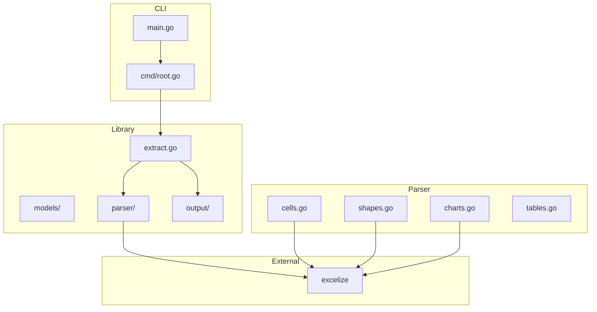

# Design Document: exstruct-go

## Overview

exstruct-go は Go 言語で実装された Excel 構造化抽出エンジンです。excelize ライブラリを使用して xlsx ファイルから構造化データを抽出し、JSON 形式で出力します。

Python 版 ExStruct の OOXML パーサー機能を Go で再実装し、以下の特徴を持ちます：

- クロスプラットフォーム対応（Linux、macOS、Windows）
- Excel 不要（純粋な OOXML パース）
- 高速な処理（Go のパフォーマンス）
- シングルバイナリ配布

## Architecture



### ディレクトリ構造

```
go/
├── cmd/
│   └── exstruct/
│       └── main.go          # CLI エントリーポイント
├── pkg/
│   └── exstruct/
│       ├── extract.go       # メイン抽出ロジック
│       ├── options.go       # 設定オプション
│       ├── models/
│       │   ├── workbook.go  # WorkbookData
│       │   ├── sheet.go     # SheetData
│       │   ├── shape.go     # Shape
│       │   ├── chart.go     # Chart, ChartSeries
│       │   └── cell.go      # CellRow
│       ├── parser/
│       │   ├── cells.go     # セル抽出
│       │   ├── shapes.go    # 図形抽出（DrawingML）
│       │   ├── charts.go    # チャート抽出（ChartML）
│       │   ├── tables.go    # テーブル候補検出
│       │   └── units.go     # EMU → ピクセル変換
│       └── output/
│           └── json.go      # JSON シリアライズ
├── go.mod
├── go.sum
└── README.md
```

## Components and Interfaces

### 1. Models（データモデル）

#### WorkbookData

```go
type WorkbookData struct {
    BookName string               `json:"book_name"`
    Sheets   map[string]SheetData `json:"sheets"`
}
```

#### SheetData

```go
type SheetData struct {
    Rows            []CellRow   `json:"rows,omitempty"`
    Shapes          []Shape     `json:"shapes,omitempty"`
    Charts          []Chart     `json:"charts,omitempty"`
    TableCandidates []string    `json:"table_candidates,omitempty"`
    PrintAreas      []PrintArea `json:"print_areas,omitempty"`
}

type PrintArea struct {
    R1 int `json:"r1"` // Start row (1-based)
    C1 int `json:"c1"` // Start column (1-based)
    R2 int `json:"r2"` // End row (1-based, inclusive)
    C2 int `json:"c2"` // End column (1-based, inclusive)
}
```

#### Shape

```go
type Shape struct {
    ID              *int    `json:"id,omitempty"`
    Text            string  `json:"text"`
    L               int     `json:"l"`
    T               int     `json:"t"`
    W               *int    `json:"w,omitempty"`
    H               *int    `json:"h,omitempty"`
    Type            string  `json:"type,omitempty"`
    Rotation        *float64 `json:"rotation,omitempty"`
    BeginArrowStyle *int    `json:"begin_arrow_style,omitempty"`
    EndArrowStyle   *int    `json:"end_arrow_style,omitempty"`
    BeginID         *int    `json:"begin_id,omitempty"`
    EndID           *int    `json:"end_id,omitempty"`
    Direction       string  `json:"direction,omitempty"`
}
```

#### Chart

```go
type Chart struct {
    Name       string        `json:"name"`
    ChartType  string        `json:"chart_type"`
    Title      string        `json:"title,omitempty"`
    YAxisTitle string        `json:"y_axis_title,omitempty"`
    YAxisRange []float64     `json:"y_axis_range,omitempty"`
    W          *int          `json:"w,omitempty"`
    H          *int          `json:"h,omitempty"`
    Series     []ChartSeries `json:"series"`
    L          int           `json:"l"`
    T          int           `json:"t"`
}

type ChartSeries struct {
    Name      string `json:"name"`
    NameRange string `json:"name_range,omitempty"`
    XRange    string `json:"x_range,omitempty"`
    YRange    string `json:"y_range,omitempty"`
}
```

#### CellRow

```go
type CellRow struct {
    R     int                    `json:"r"`
    C     map[string]interface{} `json:"c"`
    Links map[string]string      `json:"links,omitempty"`
}
```

### 2. Parser（パーサー）

#### Extract 関数

```go
func Extract(path string, opts Options) (*WorkbookData, error)
```

#### Options

```go
type Mode string

const (
    ModeLight    Mode = "light"
    ModeStandard Mode = "standard"
    ModeVerbose  Mode = "verbose"
)

type Options struct {
    Mode Mode
}
```

### 3. CLI

```go
// Usage:
// exstruct input.xlsx                    # stdout に JSON 出力
// exstruct input.xlsx -o output.json     # ファイルに出力
// exstruct input.xlsx --pretty           # 整形出力
// exstruct input.xlsx --mode verbose     # verbose モード
```

## Data Models

### JSON 出力スキーマ

```json
{
  "book_name": "sample.xlsx",
  "sheets": {
    "Sheet1": {
      "rows": [
        {"r": 1, "c": {"1": "Header1", "2": "Header2"}},
        {"r": 2, "c": {"1": 100, "2": 200}}
      ],
      "shapes": [
        {
          "id": 1,
          "text": "開始",
          "l": 100,
          "t": 200,
          "type": "AutoShape-FlowchartProcess"
        }
      ],
      "charts": [
        {
          "name": "Chart 1",
          "chart_type": "Line",
          "title": "売上データ",
          "series": [...]
        }
      ],
      "table_candidates": ["A1:D10"]
    }
  }
}
```

## Correctness Properties

*A property is a characteristic or behavior that should hold true across all valid executions of a system-essentially, a formal statement about what the system should do. Properties serve as the bridge between human-readable specifications and machine-verifiable correctness guarantees.*

### Property Reflection

After analyzing the acceptance criteria, the following properties were identified as redundant or combinable:

- Properties 1.3 and 1.4 (numeric/text type preservation) can be combined into a single type preservation property
- Properties 2.3 and 4.6 (EMU to pixel conversion) are the same conversion logic
- Properties 6.1, 6.2, 6.3 (mode filtering) can be tested with a single parameterized property

### Correctness Properties

#### Property 1: Cell Data Preservation
*For any* xlsx file with non-empty cells, extracting and re-examining the output SHALL contain all original cell values with correct row/column indices.
**Validates: Requirements 1.1, 1.2**

#### Property 2: Cell Type Preservation
*For any* cell value (numeric or text), the extracted JSON value type SHALL match the original Excel cell type.
**Validates: Requirements 1.3, 1.4**

#### Property 3: EMU to Pixel Conversion
*For any* EMU coordinate value, converting to pixels using the formula `pixels = emu / 9525` SHALL produce the correct 96 DPI pixel value.
**Validates: Requirements 2.3, 4.6**

#### Property 4: Shape Text Extraction
*For any* shape with text content, the extracted shape SHALL contain the complete text content.
**Validates: Requirements 2.2**

#### Property 5: Preset Geometry Mapping
*For any* shape with a preset geometry, the type label SHALL be a valid mapping from the PRESET_GEOM_MAP table.
**Validates: Requirements 2.5**

#### Property 6: Connector Direction Computation
*For any* connector with non-zero dimensions, the computed direction SHALL be one of the 8 compass directions based on the angle formula.
**Validates: Requirements 3.4**

#### Property 7: Shape ID Assignment Order
*For any* sheet with shapes and connectors, non-connector shapes SHALL receive sequential IDs before connector endpoints are resolved.
**Validates: Requirements 3.5**

#### Property 8: Mode Filtering
*For any* extraction with a specified mode, the output SHALL contain only the fields appropriate for that mode (light: cells+tables, standard: +shapes+charts, verbose: +dimensions+links).
**Validates: Requirements 6.1, 6.2, 6.3**

#### Property 9: JSON Schema Conformance
*For any* extracted WorkbookData, serializing to JSON and parsing back SHALL produce an equivalent structure.
**Validates: Requirements 7.1**

#### Property 10: Omit Empty Fields
*For any* field with nil/empty value, the JSON output SHALL not contain that field key.
**Validates: Requirements 7.4**

#### Property 11: UTF-8 Preservation
*For any* cell or shape text containing non-ASCII characters, the JSON output SHALL preserve the original characters.
**Validates: Requirements 7.5**

## Error Handling

### エラー種別

1. **FileNotFoundError**: 入力ファイルが存在しない
2. **InvalidFormatError**: xlsx 形式でないファイル
3. **ParseError**: XML パースエラー（警告として処理）
4. **ShapeExtractionError**: 図形抽出エラー（警告として処理）

### エラー処理方針

- ファイルレベルのエラー: 即座に error を返す
- シートレベルのエラー: 警告をログに出力し、他のシートの処理を継続
- 要素レベルのエラー: 警告をログに出力し、空のリストを返す

## Testing Strategy

### Unit Tests

- EMU → ピクセル変換の境界値テスト
- プリセットジオメトリマッピングの網羅テスト
- 方向計算の角度境界テスト
- JSON シリアライズの omitempty 動作テスト

### Property-Based Tests

Go の property-based testing には `github.com/leanovate/gopter` を使用します。

各 property test は最低 100 回のイテレーションを実行し、以下のフォーマットでコメントを付与します：

```go
// **Feature: golang-excelize, Property 1: Cell Data Preservation**
// **Validates: Requirements 1.1, 1.2**
func TestCellDataPreservation(t *testing.T) {
    // ...
}
```

### Integration Tests

- サンプル xlsx ファイルを使用した E2E テスト
- Python 版との出力比較テスト
- CLI フラグの動作テスト

## Additional Features (Python Parity)

### 印刷範囲（Print Areas）

Python 版と同様に、印刷範囲の抽出をサポートします。

```go
type PrintArea struct {
    R1 int `json:"r1"` // Start row (1-based)
    C1 int `json:"c1"` // Start column (1-based)
    R2 int `json:"r2"` // End row (1-based, inclusive)
    C2 int `json:"c2"` // End column (1-based, inclusive)
}

type SheetData struct {
    // ... existing fields ...
    PrintAreas []PrintArea `json:"print_areas,omitempty"`
}
```

印刷範囲は `xl/workbook.xml` の `definedNames` から `_xlnm.Print_Area` を解析して取得します。

### フィルタオプション

Python 版の `FilterOptions` に相当する機能：

```go
type FilterOptions struct {
    IncludeRows       bool
    IncludeShapes     bool
    IncludeShapeSize  *bool // nil = auto (verbose mode only)
    IncludeCharts     bool
    IncludeChartSize  *bool // nil = auto (verbose mode only)
    IncludeTables     bool
    IncludePrintAreas *bool // nil = auto (light=false, others=true)
}
```

### 出力先オプション

Python 版の `DestinationOptions` に相当する機能：

```go
type DestinationOptions struct {
    SheetsDir     string // Directory for per-sheet files
    PrintAreasDir string // Directory for per-print-area files
}
```

### シート単位出力

`--sheets-dir` オプションで、シートごとに個別の JSON ファイルを出力：

```bash
exstruct input.xlsx --sheets-dir sheets/
# Output: sheets/Sheet1.json, sheets/Sheet2.json, ...
```

### 印刷範囲単位出力

`--print-areas-dir` オプションで、印刷範囲ごとに個別の JSON ファイルを出力：

```bash
exstruct input.xlsx --print-areas-dir areas/
# Output: areas/Sheet1_area1.json, areas/Sheet1_area2.json, ...
```

### PrintAreaView

印刷範囲内のデータを切り出したビュー：

```go
type PrintAreaView struct {
    BookName        string    `json:"book_name"`
    SheetName       string    `json:"sheet_name"`
    Area            PrintArea `json:"area"`
    Rows            []CellRow `json:"rows,omitempty"`
    Shapes          []Shape   `json:"shapes,omitempty"`
    Charts          []Chart   `json:"charts,omitempty"`
    TableCandidates []string  `json:"table_candidates,omitempty"`
}
```

## Dependencies

### 必須依存

- `github.com/qax-os/excelize/v2`: Excel ファイル操作
- `github.com/spf13/cobra`: CLI フレームワーク

### テスト依存

- `github.com/leanovate/gopter`: Property-based testing
- `github.com/stretchr/testify`: アサーション

## Implementation Notes

### excelize の制限事項

excelize は以下の機能を直接サポートしていないため、独自実装が必要：

1. **コネクター接続情報**: DrawingML の `cNvCxnSpPr` を直接パースする必要あり
2. **グループ図形の展開**: `grpSp` 要素を再帰的にパースする必要あり
3. **チャート位置情報**: drawing.xml から graphicFrame の位置を取得する必要あり

これらは excelize の低レベル API（`GetSheetXML` 等）を使用して XML を直接パースします。

### パフォーマンス考慮

- 大きなファイルの処理: ストリーミング読み込みを検討
- メモリ使用量: 不要なデータの早期解放
- 並列処理: シート単位での並列抽出（将来的な拡張）
