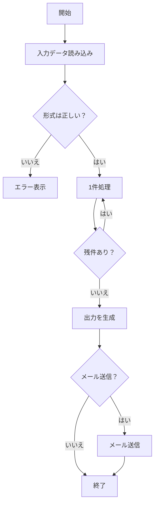

# ExStruct — Excel 構造化抽出エンジン


ExStruct は Excel ワークブックを読み取り、構造化データ（テーブル候補・図形・チャート）をデフォルトで JSON に出力します。必要に応じて YAML/TOON も選択でき、COM/Excel 環境ではリッチ抽出、非 COM 環境ではセル＋テーブル候補へのフォールバックで安全に動作します。LLM/RAG 向けに検出ヒューリスティックや出力モードを調整可能です。

## 主な特徴

- **Excel → 構造化 JSON**: セル、図形、チャート、テーブル候補をシート単位で出力。
- **出力モード**: `light`（セル＋テーブル候補のみ）、`standard`（テキスト付き図形＋矢印、チャート）、`verbose`（全図形を幅高さ付きで出力）。
- **フォーマット**: JSON（デフォルトはコンパクト、`--pretty` で整形）、YAML、TOON（任意依存）。
- **テーブル検出のチューニング**: API でヒューリスティックを動的に変更可能。
- **CLI レンダリング**（Excel 必須）: PDF とシート画像を生成可能。
- **安全なフォールバック**: Excel COM 不在でもプロセスは落ちず、セル＋テーブル候補に切り替え。

## インストール

```bash
pip install exstruct
```

オプション依存:

- YAML: `pip install pyyaml`
- TOON: `pip install python-toon`
- レンダリング（PDF/PNG）: Excel + `pip install pypdfium2`

## クイックスタート CLI

```bash
exstruct input.xlsx                # デフォルトはコンパクト JSON
exstruct input.xlsx --pretty       # 整形 JSON
exstruct input.xlsx --format yaml  # YAML（pyyaml が必要）
exstruct input.xlsx --format toon  # TOON（python-toon が必要）
exstruct input.xlsx --mode light   # セル＋テーブル候補のみ
exstruct input.xlsx --pdf --image  # PDF と PNG（Excel 必須）
```

## クイックスタート Python

```python
from pathlib import Path
from exstruct import extract, export, set_table_detection_params

# テーブル検出を調整（任意）
set_table_detection_params(table_score_threshold=0.3, density_min=0.04)

# モード: "light" / "standard" / "verbose"
wb = extract("input.xlsx", mode="standard")
export(wb, Path("out.json"), pretty=False)  # コンパクト JSON
```

## テーブル検出パラメータ

```python
from exstruct import set_table_detection_params

set_table_detection_params(
    table_score_threshold=0.35,  # 厳しくするなら上げる
    density_min=0.05,
    coverage_min=0.2,
    min_nonempty_cells=3,
)
```

値を上げると誤検知が減り、下げると検出漏れが減ります。

## 出力モード

- **light**: セル＋テーブル候補のみ（COM 不要）。
- **standard**: テキスト付き図形＋矢印、チャート（COM ありで取得）、テーブル候補。
- **verbose**: 全図形（幅・高さ付き）、チャート、テーブル候補。

## エラーハンドリング / フォールバック

- Excel COM 不在時はセル＋テーブル候補に自動フォールバック（図形・チャートは空）。
- 図形抽出失敗時も警告を出しつつセル＋テーブル候補を返却。
- CLI はエラーを stdout/stderr に出し、失敗時は非ゼロ終了コード。

## 任意レンダリング

Excel と `pypdfium2` が必要です:

```bash
exstruct input.xlsx --pdf --image --dpi 144
```

`<output>.pdf` と `<output>_images/` 配下に PNG を生成します。

## ベンチマーク: Excel 構造化デモ

本ライブラリ exstruct がどの程度 Excel を構造化できるのかを示すため、
以下の 3 要素を 1 シートにまとめた Excel を解析し、
その JSON 出力を用いた AI 推論精度ベンチマーク を掲載します。

- 表（売上データ）
- 折れ線グラフ
- 図形のみで作成したフローチャート

（下画像が実際のサンプル Excel シート）


### 1. Input: Excel Sheet Overview

このサンプル Excel には以下のデータが含まれています：

### ① 表 (売上データ)

| 月     | 製品 A | 製品 B | 製品 C |
| ------ | ------ | ------ | ------ |
| Jan-25 | 120    | 80     | 60     |
| Feb-25 | 135    | 90     | 64     |
| Mar-25 | 150    | 100    | 70     |
| Apr-25 | 170    | 110    | 72     |
| May-25 | 160    | 120    | 75     |
| Jun-25 | 180    | 130    | 80     |

### ② グラフ (折れ線グラフ)

- タイトル: 売上データ
- 系列: 製品 A / 製品 B / 製品 C（半年分）
- Y 軸: 0–200

### ③ 図形によるフローチャート

シート内に以下を含むフローがあります：

- 開始 / 終了
- 形式チェック
- ループ（残件あり？）
- エラーハンドリング
- メール送信の Yes/No 判定

### 2. Output: exstruct が生成する構造化 JSON（抜粋）

以下は、実際にこの Excel ブックを解析した際の**短縮版 JSON 出力例** です。

```json
{
  "book_name": "sample.xlsx",
  "sheets": {
    "Sheet1": {
      "rows": [
        {
          "r": 3,
          "c": {
            "1": "月",
            "2": "製品A",
            "3": "製品B",
            "4": "製品C"
          }
        },
        ...
      ],
      "shapes": [
        {
          "text": "開始",
          "l": 148,
          "t": 220,
          "type": "AutoShape-FlowchartProcess"
        },
        {
          "text": "入力データ読み込み",
          "l": 132,
          "t": 282,
          "type": "AutoShape-FlowchartProcess"
        },
        {
          "l": 193,
          "t": 246,
          "type": "AutoShape-Mixed",
          "begin_arrow_style": 1,
          "end_arrow_style": 2,
          "direction": "N"
        },
        ...
      ],
      "charts": [
        {
          "name": "Chart 1",
          "chart_type": "Line",
          "title": "売上データ",
          "y_axis_range": [
            0.0,
            200.0
          ],
          "series": [
            {
              "name": "製品A",
              "name_range": "Sheet1!$C$3",
              "x_range": "Sheet1!$B$4:$B$9",
              "y_range": "Sheet1!$C$4:$C$9"
            },
            ...
          ],
          "l": 377,
          "t": 25
        }
      ],
      "table_candidates": [
        "B3:E9"
      ]
    }
  }
}
```

### 3. AI (Copilot / LLM) に JSON を渡した際の理解結果

````md
以下は、提供された Excel ブックの内容を Markdown 形式で再構成したものです。表、グラフ、フローチャートの 3 要素をそれぞれ適切に表現しています。

---

## 📊 売上データ表

| 月         | 製品 A | 製品 B | 製品 C |
| ---------- | ------ | ------ | ------ |
| 2025-01-01 | 120    | 80     | 60     |
| 2025-02-01 | 135    | 90     | 64     |
| 2025-03-01 | 150    | 100    | 70     |
| 2025-04-01 | 170    | 110    | 72     |
| 2025-05-01 | 160    | 120    | 75     |
| 2025-06-01 | 180    | 130    | 80     |

---

## 📈 売上データ（折れ線グラフ）

- グラフタイトル: **売上データ**
- グラフ種類: 折れ線グラフ（Line）
- Y 軸範囲: 0 ～ 200
- データ系列:
  - 製品 A: 120 → 135 → 150 → 170 → 160 → 180
  - 製品 B: 80 → 90 → 100 → 110 → 120 → 130
  - 製品 C: 60 → 64 → 70 → 72 → 75 → 80

---

## 🔄 処理フロー（Mermaid フローチャート）


````

このことから、

**exstruct の JSON は AI にとって "そのまま意味として理解できる形式" である**

ということが明確に示されています。

### 4. Summary

このベンチマークにより、本ライブラリが次の能力を持つことが確認できます：

- **表・グラフ・図形（フローチャート）の同時解析**
- Excel の意味的構造を JSON に変換
- AI（LLM）がその JSON を直接読み取り、Excel 内容を再構築できる

つまり **exstruct = “Excel を AI が理解できるフォーマットに変換するエンジン”** です。

## 備考

- デフォルト JSON はコンパクト（トークン削減目的）。可読性が必要なら `--pretty` / `pretty=True` を利用してください。
- フィールド名は `table_candidates` を使用します（以前の `tables` から変更）。下流のスキーマを調整してください。

## License

BSD-3-Clause. See `LICENSE` for details.

## ドキュメント

- API リファレンス (GitHub Pages): https://harumiweb.github.io/exstruct/