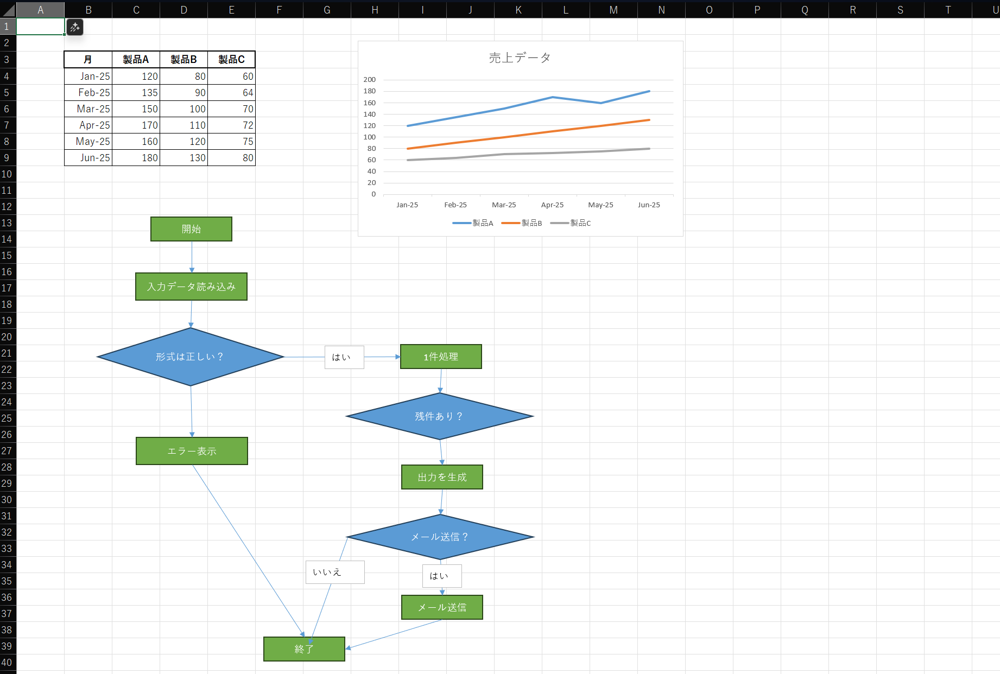
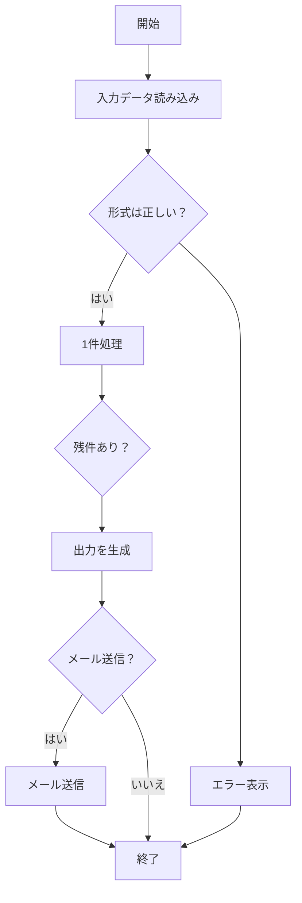
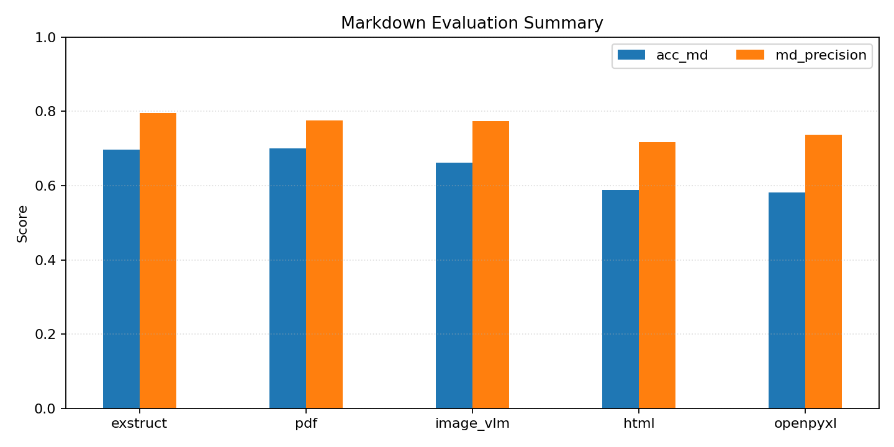

<p align="center">
  <a href="https://harumiweb.github.io/exstruct/">
    
  </a>
</p>

<p align="center">
  <em>Excel Structured Extraction Engine</em>
</p>

<div align="center" style="max-width: 600px; margin: auto;">

[](https://pypi.org/project/exstruct/) [](https://pepy.tech/projects/exstruct)  [](https://github.com/harumiWeb/exstruct/actions/workflows/pytest.yml) [](https://app.codacy.com/gh/harumiWeb/exstruct/dashboard?utm_source=gh&utm_medium=referral&utm_content=&utm_campaign=Badge_grade) [](https://codecov.io/gh/harumiWeb/exstruct) [](https://deepwiki.com/harumiWeb/exstruct) 

</div>

# ExStruct — Excel 構造化抽出エンジン

ExStruct は Excel ワークブックを構造化データへ抽出し、shared core を通じて
patch-based な編集フローも扱えます。抽出 API、JSON-first editing CLI、
host-managed integration 向けの MCP サーバーを提供し、LLM/RAG 向け前処理、
レビューしやすい編集フロー、ローカル自動化に使える設計になっています。

- COM/Excel 環境 (Windows) ではリッチ抽出
- 非 COM 環境 (Linux/macOS) では
  - LibreOffice runtime があればセル・テーブル候補・図形・グラフ（best-effort）
  - それ以外の環境ではセル＋テーブル候補＋印刷範囲へのフォールバックで安全に動作します。

LLM/RAG 向けに検出ヒューリスティックや出力モードを調整でき、編集ワーク
フローも同じ責務分離で扱えます。

## インターフェースの選び方

| 用途 | 推奨インターフェース | 理由 |
| --- | --- | --- |
| Python で直接 Excel 編集コードを書く | `openpyxl` / `xlwings` | imperative な Python 編集にはこちらの方が普通は適しています。`exstruct.edit` は ExStruct の patch contract を Python から再利用したい場合だけ使います。 |
| ローカル運用や AI エージェントの編集フローを回す | `exstruct patch` / `make` / `ops` / `validate` | canonical operational interface。JSON-first で `dry_run` に向きます。 |
| sandboxed / host-managed integration を動かす | `exstruct-mcp` / MCP tools | `PathPolicy`、transport、artifact behavior を持つ integration / compatibility layer です。 |

抽出については、従来どおり top-level Python API（`extract`,
`process_excel`, `ExStructEngine`）と `exstruct INPUT.xlsx ...` CLI を使います。

## 主な特徴

- **Excel → 構造化 JSON**: セル、図形、チャート、SmartArt、テーブル候補、セル結合範囲、印刷範囲/自動改ページ範囲（PrintArea/PrintAreaView）をシート単位・範囲単位で出力。
- **出力モード**: `light`（セル＋テーブル候補＋印刷範囲のみ）、`libreoffice`（`.xlsx/.xlsm` 向けの best-effort 非 COM モード。LibreOffice runtime があれば結合セル・図形・コネクタ・チャートを追加）、`standard`（Excel COM でテキスト付き図形＋矢印、チャート、SmartArt、セル結合範囲）、`verbose`（全図形を幅高さ付きで出力、セルのハイパーリンクも出力）。
- **数式取得**: `formulas_map`（数式文字列 → セル座標）を openpyxl/COM で取得。`verbose` 既定、`include_formulas_map` で制御。
- **フォーマット**: JSON（デフォルトはコンパクト、`--pretty` で整形）、YAML、TOON（任意依存）。
- **backend metadata は opt-in**: shape/chart の `provenance` / `approximation_level` / `confidence` は、トークン節約のため既定では直列化出力に含めません。必要な場合だけ `--include-backend-metadata` または `include_backend_metadata=True` を使います。
- **ワークブック編集インターフェース**: ExStruct の主な編集導線は editing CLI、host 側制御が必要な場合は MCP tools、Python から `exstruct.edit` を使うのは同じ patch contract を再利用したい場合に限ります。
- **テーブル検出のチューニング**: API でヒューリスティックを動的に変更可能。
- **ハイパーリンク抽出**: `verbose` モード（または `include_cell_links=True` 指定）でセルのリンクを `links` に出力。
- **CLI レンダリング**（Excel COM 必須）: `standard` / `verbose` では PDF とシート画像を生成可能。
- **安全なフォールバック**: Excel COM または LibreOffice runtime が不在でもプロセスは落ちず、セル＋テーブル候補＋印刷範囲に切り替えます（図形・チャートは空）。

## インストール

```bash
pip install exstruct
```

オプション依存:

- YAML: `pip install pyyaml`
- TOON: `pip install python-toon`
- レンダリング（PDF/PNG）: Excel + `pip install pypdfium2 pillow`（`mode=libreoffice` では非対応）
- まとめて導入: `pip install exstruct[yaml,toon,render]`

プラットフォーム注意:

- 図形・チャートを含む COM 抽出は Windows + Excel (xlwings/COM) 前提です。Linux/macOS/server 環境では `mode=libreoffice` を best-effort rich mode として使うか、`mode=light` で最小抽出を使ってください。`.xls` は `mode=libreoffice` 非対応です。
- Debian/Ubuntu/WSL では LibreOffice と `python3-uno` を一緒に導入してください。`mode=libreoffice` は互換な system Python を自動検出し、必要なら `EXSTRUCT_LIBREOFFICE_PYTHON_PATH=/usr/bin/python3` で明示指定できます。
- LibreOffice 用 Python の検出では、候補 interpreter に対して bundled bridge の `--probe` を実行してから採用します。互換性のない `EXSTRUCT_LIBREOFFICE_PYTHON_PATH` は、抽出中の遅延 `SyntaxError` ではなく早期の互換性エラーとして失敗します。
- 一時的な孤立 LibreOffice profile で UNO socket の起動に失敗した場合、ExStruct は互換性 fallback として shared/default profile で 1 回だけ再試行し、両方失敗したときは各試行の起動詳細をエラーに含めます。
- GitHub Actions では `ubuntu-24.04` と `windows-2025` に LibreOffice smoke job があります。Linux は `libreoffice` と `python3-uno`、Windows は `libreoffice-fresh` と `EXSTRUCT_LIBREOFFICE_PATH` を設定し、どちらも `RUN_LIBREOFFICE_SMOKE=1` 付きで `tests/core/test_libreoffice_smoke.py` を実行します。

## クイックスタート CLI

```bash
exstruct input.xlsx > output.json          # デフォルトは標準出力のコンパクト JSON
exstruct input.xlsx -o out.json --pretty   # 整形 JSON をファイルへ
exstruct input.xlsx --format yaml          # YAML（pyyaml が必要）
exstruct input.xlsx --format toon          # TOON（python-toon が必要）
exstruct input.xlsx --sheets-dir sheets/   # シートごとに分割出力
exstruct input.xlsx --auto-page-breaks-dir auto_areas/  # 常時表示。実行には standard/verbose + Excel COM が必要
exstruct input.xlsx --alpha-col           # 列キーを A, B, ..., AA 形式で出力
exstruct input.xlsx --include-backend-metadata  # shape/chart の backend metadata を含める
exstruct input.xlsx --mode light           # セル＋テーブル候補のみ
exstruct input.xlsx --mode libreoffice     # COM なしで図形/コネクタ/チャートを best-effort 抽出
exstruct input.xlsx --pdf --image          # PDF と PNG（Excel COM 必須）
```

自動改ページ範囲の書き出しは API/CLI 両方に対応（Excel/COM が必要）し、CLI では `--auto-page-breaks-dir` を常時表示したうえで実行時に検証します。
`mode=libreoffice` では `--pdf` / `--image` / `--auto-page-breaks-dir` を早期エラーにし、`mode=light` でも `--auto-page-breaks-dir` を拒否します。これらの機能は `standard` または `verbose` + Excel COM を前提にします。
CLI の既定では列キーは従来どおり 0 始まりの数値文字列（`"0"`, `"1"`, ...）です。Excel 形式（`"A"`, `"B"`, ...）が必要な場合は `--alpha-col` を指定してください。
CLI の既定では shape/chart の `provenance` / `approximation_level` / `confidence` も出力しません。必要な場合は `--include-backend-metadata` を指定してください。
注意: MCP の `exstruct_extract` は `options.alpha_col=true` が既定で、CLI の既定（`false`）とは異なります。

## クイックスタート Editing CLI

```bash
exstruct patch --input book.xlsx --ops ops.json --backend openpyxl
exstruct patch --input book.xlsx --ops - --dry-run --pretty < ops.json
exstruct make --output new.xlsx --ops ops.json --backend openpyxl
exstruct ops list
exstruct ops describe create_chart --pretty
exstruct validate --input book.xlsx --pretty
```

- `patch` / `make` は JSON の `PatchResult` を標準出力に出します。
- workbook editing の canonical operational / agent interface はこの editing CLI です。
- `ops list` / `ops describe` で public patch-op schema を確認できます。
- `validate` はワークブックの読取可否（`is_readable`, `warnings`, `errors`）を返します。
- Phase 2 では既存の抽出 CLI はそのまま維持し、`exstruct extract` や対話的な safety flag はまだ追加しません。

推奨フロー:

1. patch ops を組み立てる。
2. `exstruct patch --dry-run` を実行し、`PatchResult`・warnings・diff を確認する。
3. dry run と実適用で同じ engine を使いたい場合は `--backend openpyxl` を固定する。
4. `--backend auto` を使う場合は `PatchResult.engine` を確認する。Windows/Excel 環境では実適用時に COM へ切り替わることがある。
5. 問題がなければ `--dry-run` なしで再実行する。

## ExStruct CLI Skill

ExStruct には、editing CLI を安全に使うための repo 管理 Skill も 1 つ含めています。

repo 上の正本:

- `.agents/skills/exstruct-cli/`

次の 1 コマンドでインストールできます。

```bash
npx skills add harumiWeb/exstruct/.agents/skills --skill exstruct-cli
```

このコマンドは、このリポジトリで公開される Skill ディレクトリから
`exstruct-cli` を直接追加する想定です。まだ未公開ブランチで作業している場合や、
`npx skills add` を使えない実行環境では、従来どおり `SKILL.md` ベースの Skill が
検出されるローカルディレクトリへ同じフォルダを手動配置してください。

この Skill は、`patch` / `make` / `validate` / `ops list` /
`ops describe` の使い分けや、安全な
`validate -> dry-run -> PatchResult/diff を確認 -> apply -> verify`
フローが必要なときに使います。

エージェント向けの最小プロンプト例:

> `$exstruct-cli` を使って適切な ExStruct editing CLI コマンドを選び、PatchResult/diff の確認を含む validate/dry-run の安全なフローと、このワークブック作業に関係する backend 制約を説明してください。

## MCPサーバー (標準入出力)

MCP は同じ editing core を包む integration / compatibility layer です。
path restriction、transport mapping、artifact mirroring、approval-aware な
agent 実行が必要なときに使ってください。通常の Python workbook editing には
`openpyxl` / `xlwings` の方が合っています。ローカル shell / agent workflow
では editing CLI を優先します。

もし editing が MCP-first だった時期の名残で `exstruct_patch` /
`exstruct_make` を直接使っているだけなら、MCP host control が必要な場合を
除いて、新規のローカル workflow は `exstruct patch` / `exstruct make`
へ寄せてください。Python から同じ patch contract を使いたい場合だけ
`exstruct.edit` を検討してください。

### uvx を使ったクイックスタート（推奨）

インストール不要で直接実行できます：

```bash
uvx --from 'exstruct[mcp]' exstruct-mcp --root C:\data --log-file C:\logs\exstruct-mcp.log --on-conflict rename
```

利点：

- `pip install` が不要
- 依存関係の自動管理
- 環境の分離
- バージョン指定が簡単: `uvx --from 'exstruct[mcp]==0.4.4' exstruct-mcp`

### 従来のインストール方法

pip でインストールすることもできます：

```bash
pip install exstruct[mcp]
exstruct-mcp --root C:\data --log-file C:\logs\exstruct-mcp.log --on-conflict rename
```

利用可能なツール:

- `exstruct_extract`
- `exstruct_capture_sheet_images`
- `exstruct_make`
- `exstruct_patch`
- `exstruct_read_json_chunk`
- `exstruct_read_range`
- `exstruct_read_cells`
- `exstruct_read_formulas`
- `exstruct_validate_input`

注意点:

- `exstruct_capture_sheet_images` は COM 専用（Experimental）で、`sheet` / `range`（`A1:B2`, `Sheet1!A1:B2`, `'Sheet 1'!A1:B2`）の指定に対応します。`out_dir` 未指定時は MCP `--root` 配下に一意な `<workbook_stem>_images` ディレクトリを作成します。
- MCP サーバー起動時は `EXSTRUCT_RENDER_SUBPROCESS=1` が既定（`setdefault`）です。同一プロセスで実行したい場合は、起動前に `EXSTRUCT_RENDER_SUBPROCESS=0` を明示指定してください。
- `exstruct_capture_sheet_images` のタイムアウト調整: `EXSTRUCT_MCP_CAPTURE_SHEET_IMAGES_TIMEOUT_SEC`（ツール全体）, `EXSTRUCT_RENDER_SUBPROCESS_STARTUP_TIMEOUT_SEC`（worker 起動）, `EXSTRUCT_RENDER_SUBPROCESS_JOIN_TIMEOUT_SEC`（主待機予算）, `EXSTRUCT_RENDER_SUBPROCESS_RESULT_TIMEOUT_SEC`（終了後の結果待ち猶予）。
- サブプロセス失敗は `stage=startup|join|result|worker` の形で返るため、起動失敗・タイムアウト・worker 側失敗を切り分けできます。
- `EXSTRUCT_RENDER_SUBPROCESS=1` のトレードオフ: サブプロセス起動/同期オーバーヘッドと、worker 側のモジュール解決依存が増えます。
- `EXSTRUCT_RENDER_SUBPROCESS=0` のトレードオフ: クラッシュ分離が弱くなり、長時間稼働時のメモリ圧迫リスクが上がります。
- 標準入出力の応答を汚染しないよう、ログは標準エラー出力（およびオプションで`--log-file`で指定したファイル）に出力されます。
- Windows の Excel 環境では `standard` / `verbose` が COM を使って最もリッチな抽出を行います。
- Linux/macOS/server 環境では `libreoffice` が best-effort rich mode です。COM 出力の strict subset ではなく、LibreOffice + OOXML 由来の再構成なので精度差があります。
- `libreoffice` は v1 では PDF/PNG rendering と auto page-break 計算を行いません。
- `exstruct_patch` は `backend` 指定をサポートします。
  - `auto`（既定）: COM が使える場合は COM を優先し、不可なら openpyxl
  - `com`: COM を強制（`dry_run` / `return_inverse_ops` / `preflight_formula_check` は指定不可）
  - `openpyxl`: openpyxl を強制（`.xls` は非対応）
- `create_chart` は COM 専用です（`create_chart` を含むリクエストでは `backend="openpyxl"` は指定不可）。また、`dry_run` / `return_inverse_ops` / `preflight_formula_check` も指定できません。
- `create_chart` の `chart_type` は `line` / `column` / `bar` / `area` / `pie` / `doughnut` / `scatter` / `radar` に対応します（エイリアス: `column_clustered` / `bar_clustered` / `xy_scatter` / `donut`）。
- `create_chart` の `data_range` は単一範囲文字列または `list[str]`（複数系列）を受け付け、`data_range` / `category_range` ともにシート名付き範囲（`Sheet2!A1:B10`, `'Sales Data'!A1:B10`）を指定できます。
- `create_chart` では `chart_title` / `x_axis_title` / `y_axis_title` による明示タイトル設定が可能です。
- `create_chart` と `apply_table_style` は、バックエンドが COM に解決される場合（`backend="com"` または COM 利用可能な `backend="auto"`）は1回のリクエストで同時指定できます。
- Windows で `apply_table_style` を COM で安定実行するには、デスクトップ版 Excel が起動可能で、`range` がヘッダー行を含む連続 A1 範囲であることを確認してください。
- `exstruct_patch` のエラー詳細には `error_code` / `failed_field` / `raw_com_message` が含まれる場合があります。テーブル関連コードは `table_style_invalid` / `list_object_add_failed` / `com_api_missing` です。
- `exstruct_patch` の応答には実際に使われたバックエンドを示す `engine`（`com` / `openpyxl`）が含まれます。`restore_design_snapshot` は引き続き openpyxl 専用です。
- 新規ブック作成は `exstruct_make`、既存ブック編集は `exstruct_patch` を使い分けてください。
- `exstruct_make` は新規ブック作成と `ops` 適用を1回で実行します（`out_path` 必須、`ops` は任意）。
  - 対応拡張子: `.xlsx` / `.xlsm` / `.xls`
  - 初期シート名は `Sheet1` に正規化されます
  - `.xls` は COM 必須で、`backend=openpyxl` は指定できません

各AIエージェントでのMCP設定ガイド:

[MCPサーバー](https://harumiweb.github.io/exstruct/mcp/)

## クイックスタート Python Extraction

```python
from pathlib import Path
from exstruct import extract, export, set_table_detection_params

# テーブル検出を調整（任意）
set_table_detection_params(table_score_threshold=0.3, density_min=0.04)

# モード: "light" / "standard" / "verbose"
wb = extract("input.xlsx", mode="standard")  # standard ではリンクはデフォルト非出力
export(wb, Path("out.json"), pretty=False)  # コンパクト JSON
export(wb, Path("out.json"), include_backend_metadata=True)  # backend metadata も含める

# モデルの便利メソッド: 反復・インデックス・直列化
first_sheet = wb["Sheet1"]           # __getitem__ でシート取得
for name, sheet in wb:               # __iter__ で (name, SheetData) を列挙
    print(name, len(sheet.rows))
wb.save("out.json", pretty=True)     # WorkbookData を拡張子に応じて保存
first_sheet.save("sheet.json")       # SheetData も同様に保存
print(first_sheet.to_yaml())         # YAML 文字列（pyyaml 必須）
print(first_sheet.to_json(include_backend_metadata=True))  # 必要なときだけ backend metadata を含める

# ExStructEngine: インスタンスごとの設定（ネスト構造）
from exstruct import (
    DestinationOptions,
    ExStructEngine,
    FilterOptions,
    FormatOptions,
    OutputOptions,
    StructOptions,
    export_auto_page_breaks,
)

engine = ExStructEngine(
    options=StructOptions(mode="verbose"),  # verbose ではハイパーリンクがデフォルトで含まれる
    output=OutputOptions(
        format=FormatOptions(pretty=True),
        filters=FilterOptions(
            include_shapes=False,
            include_backend_metadata=True,
        ),  # 図形を除外しつつ backend metadata は保持
        destinations=DestinationOptions(sheets_dir=Path("out_sheets")),  # シートごとに保存
    ),
)
wb2 = engine.extract("input.xlsx")
engine.export(wb2, Path("out_filtered.json"))  # フィルタ適用後の出力

# standard でハイパーリンクを有効化
engine_links = ExStructEngine(options=StructOptions(mode="standard", include_cell_links=True))
with_links = engine_links.extract("input.xlsx")

# 印刷範囲ごとに書き出す
from exstruct import export_print_areas_as
export_print_areas_as(wb, "areas", fmt="json", pretty=True)  # 印刷範囲がある場合のみファイル生成

# 自動改ページ範囲の抽出/出力（COM 限定。自動改ページが無い場合は例外を送出）
engine_auto = ExStructEngine(
    output=OutputOptions(
        destinations=DestinationOptions(auto_page_breaks_dir=Path("auto_areas"))
    )
)
wb_auto = engine_auto.extract("input.xlsx")  # SheetData.auto_print_areas を含む
engine_auto.export(wb_auto, Path("out_with_auto.json"))  # 自動改ページごとのファイルも auto_areas/* に保存
export_auto_page_breaks(wb_auto, "auto_areas", fmt="json", pretty=True)
```

**備考 (COM 非対応環境):** Excel COM が使えない場合でもセル＋`table_candidates` は返りますが、`shapes` / `charts` は空になります。

## テーブル検出パラメータ

```python
from exstruct import set_table_detection_params

set_table_detection_params(
    table_score_threshold=0.35,  # 厳しくするなら上げる
    density_min=0.05,
    coverage_min=0.2,
    min_nonempty_cells=3,
)
```

値を上げると誤検知が減り、下げると検出漏れが減ります。

## 出力モード

- **light**: セル＋テーブル候補のみ（COM 不要）。
- **standard**: テキスト付き図形＋矢印、チャート（COM ありで取得）、テーブル候補。セルのハイパーリンクは `include_cell_links=True` を指定したときのみ出力。
- **verbose**: all shapes, charts, table_candidates, hyperlinks, and `colors_map`.

## エラーハンドリング / フォールバック

- Excel COM 不在時はセル＋テーブル候補に自動フォールバック（図形・チャートは空）。
- 図形抽出失敗時も警告を出しつつセル＋テーブル候補を返却。
- CLI はエラーを stdout/stderr に出し、失敗時は非ゼロ終了コード。

## 任意レンダリング

Excel と `pypdfium2` が必要です:

```bash
exstruct input.xlsx --pdf --image --dpi 144
```

`<output>.pdf` と `<output>_images/` 配下に PNG を生成します。

## 例 ①: Excel 構造化デモ

本ライブラリ exstruct がどの程度 Excel を構造化できるのかを示すため、
以下の 3 要素を 1 シートにまとめた Excel を解析し、
その JSON 出力を用いた LLM 推論例 を掲載します。

- 表（売上データ）
- 折れ線グラフ
- 図形のみで作成したフローチャート

（下画像が実際のサンプル Excel シート）

サンプル Excel: `sample/sample.xlsx`

### 1. Input: Excel Sheet Overview

このサンプル Excel には以下のデータが含まれています：

### ① 表 (売上データ)

| 月     | 製品 A | 製品 B | 製品 C |
| ------ | ------ | ------ | ------ |
| Jan-25 | 120    | 80     | 60     |
| Feb-25 | 135    | 90     | 64     |
| Mar-25 | 150    | 100    | 70     |
| Apr-25 | 170    | 110    | 72     |
| May-25 | 160    | 120    | 75     |
| Jun-25 | 180    | 130    | 80     |

### ② グラフ (折れ線グラフ)

- タイトル: 売上データ
- 系列: 製品 A / 製品 B / 製品 C（半年分）
- Y 軸: 0–200

### ③ 図形によるフローチャート

シート内に以下を含むフローがあります：

- 開始 / 終了
- 形式チェック
- ループ（残件あり？）
- エラーハンドリング
- メール送信の Yes/No 判定

### 2. Output: exstruct が生成する構造化 JSON（抜粋）

以下は、実際にこの Excel ブックを解析した際の**短縮版 JSON 出力例** です。

```json
{
  "book_name": "sample.xlsx",
  "sheets": {
    "Sheet1": {
      "rows": [
        {
          "r": 3,
          "c": {
            "1": "月",
            "2": "製品A",
            "3": "製品B",
            "4": "製品C"
          }
        },
        ...
      ],
      "shapes": [
        {
          "id": 1,
          "text": "開始",
          "l": 148,
          "t": 220,
          "kind": "shape",
          "type": "AutoShape-FlowchartProcess"
        },
        {
          "id": 2,
          "text": "入力データ読み込み",
          "l": 132,
          "t": 282,
          "kind": "shape",
          "type": "AutoShape-FlowchartProcess"
        },
        {
          "l": 193,
          "t": 246,
          "kind": "arrow",
          "begin_arrow_style": 1,
          "end_arrow_style": 2,
          "begin_id": 1,
          "end_id": 2,
          "direction": "N"
        },
        ...
      ],
      "charts": [
        {
          "name": "Chart 1",
          "chart_type": "Line",
          "title": "売上データ",
          "y_axis_range": [
            0.0,
            200.0
          ],
          "series": [
            {
              "name": "製品A",
              "name_range": "Sheet1!$C$3",
              "x_range": "Sheet1!$B$4:$B$9",
              "y_range": "Sheet1!$C$4:$C$9"
            },
            ...
          ],
          "l": 377,
          "t": 25
        }
      ],
      "table_candidates": [
        "B3:E9"
      ]
    }
  }
}
```

### 3. AI (Copilot / LLM) に JSON を渡した際の理解結果

````md
以下は、提供された Excel ブックの内容を Markdown 形式で再構成したものです。表、グラフ、フローチャートの 3 要素をそれぞれ適切に表現しています。

---

## 📊 売上データ表

| 月         | 製品 A | 製品 B | 製品 C |
| ---------- | ------ | ------ | ------ |
| 2025-01-01 | 120    | 80     | 60     |
| 2025-02-01 | 135    | 90     | 64     |
| 2025-03-01 | 150    | 100    | 70     |
| 2025-04-01 | 170    | 110    | 72     |
| 2025-05-01 | 160    | 120    | 75     |
| 2025-06-01 | 180    | 130    | 80     |

---

## 📈 売上データ（折れ線グラフ）

- グラフタイトル: **売上データ**
- グラフ種類: 折れ線グラフ（Line）
- Y 軸範囲: 0 ～ 200
- データ系列:
  - 製品 A: 120 → 135 → 150 → 170 → 160 → 180
  - 製品 B: 80 → 90 → 100 → 110 → 120 → 130
  - 製品 C: 60 → 64 → 70 → 72 → 75 → 80

---

## 🔄 処理フロー（Mermaid フローチャート）


```mermaid
flowchart TD
    A[開始]
    B[入力データ読み込み]
    C{形式は正しい？}
    D[1件処理]
    E{残件あり？}
    F[出力を生成]
    G{メール送信？}
    H[エラー表示]
    I[メール送信]
    J[終了]

    A --> B
    B --> C
    C -->|はい| D
    C --> H
    D --> E
    E --> F
    F --> G
    G -->|はい| I
    G -->|いいえ| J
    H --> J
    I --> J
```
````

## 例 ②: 一般的な申請書

### Excel データ


### ExStruct JSON

※長いので一部省略

```json
{
  "book_name": "ja_form.xlsx",
  "sheets": {
    "Sheet1": {
      "rows": [
        { "r": 1, "c": { "0": "介護保険負担限度額認定申請書" } },
        {
          "r": 3,
          "c": { "0": "（申請先）", "7": "  　　　　年　　　　月　　　　日" }
        },
        { "r": 4, "c": { "1": "X市長　" } },
        ...
      ],
      "table_candidates": ["B25:C26", "C37:D50"],
      "merged_cells": {
        "schema": ["r1", "c1", "r2", "c2", "v"],
        "items": [
          [55, 5, 55, 10, "申請者が被保険者本人の場合には、下記について記載は不要です。"],
          [54, 8, 54, 10, " "],
          [51, 5, 52, 6, "有価証券"],
          ...
        ]
      }
    }
  }
}

```

### LLM 推論による ExStruct JSON → Markdown 変換結果

```md
# 介護保険負担限度額認定申請書

（申請先）　　　　　　　　　　　　　　年　　月　　日  
X 市長

次のとおり関係書類を添えて、食費・居住費（滞在費）に係る負担限度額認定を申請します。

---

## 被保険者情報

| 項目         | 内容                         |
| ------------ | ---------------------------- |
| フリガナ     |                              |
| 被保険者氏名 |                              |
| 被保険者番号 |                              |
| 個人番号     |                              |
| 生年月日     | 明・大・昭　　年　　月　　日 |
| 住所         |                              |
| 連絡先       |                              |

---

## 入所（院）した介護保険施設

| 項目                  | 内容       |
| --------------------- | ---------- |
| 施設所在地・名称（※） |            |
| 連絡先                |            |
| 入所（院）年月日      | 年　月　日 |

**（※）介護保険施設に入所（院）していない場合、およびショートステイ利用時は記入不要**

---

## 配偶者の有無

| 項目         | 内容     |
| ------------ | -------- |
| 配偶者の有無 | 有 ・ 無 |

※「無」の場合、以下の「配偶者に関する事項」は記入不要

---

## 配偶者に関する事項

| 項目                                           | 内容                       |
| ---------------------------------------------- | -------------------------- |
| フリガナ                                       |                            |
| 氏名                                           |                            |
| 生年月日                                       | 明・大・昭　年　月　日     |
| 個人番号                                       |                            |
| 住所                                           | 〒                         |
| 連絡先                                         |                            |
| 本年 1 月 1 日現在の住所（現住所と異なる場合） | 〒                         |
| 課税状況                                       | 市町村民税：課税 ・ 非課税 |

---

## 収入等に関する申告

以下の該当する項目にチェックしてください。

- □ ① 生活保護受給者
- □ ② 市町村民税世帯非課税である老齢福祉年金受給者
- □ ③ 市町村民税世帯非課税者で、課税年金収入額＋遺族年金・障害年金＋その他所得の合計が **年額 80 万円以下**
- □ ④ 同上で **80 万円超〜120 万円以下**
- □ ⑤ 同上で **120 万円超**

※遺族年金には寡婦年金、寡夫年金、母子年金、準母子年金、遺児年金を含む

---

## 預貯金等に関する申告

- □ 預貯金・有価証券等の合計額が以下の基準以下である
  - ② の方：1000 万円（夫婦 2000 万円）
  - ③ の方：650 万円（夫婦 1650 万円）
  - ④ の方：550 万円（夫婦 1550 万円）
  - ⑤ の方：500 万円（夫婦 1500 万円）
  - ※第 2 号被保険者（40〜64 歳）は ③〜⑤ の方：1000 万円（夫婦 2000 万円）以下

### 預貯金等の内訳

| 項目                       | 金額             |
| -------------------------- | ---------------- |
| 預貯金額                   | 円               |
| 有価証券（評価概算額）     | 円               |
| その他（現金・負債を含む） | 円（内容を記入） |

---

## 申請者情報（※被保険者本人の場合は不要）

| 項目                   | 内容 |
| ---------------------- | ---- |
| 申請者氏名             |      |
| 連絡先（自宅・勤務先） |      |
| 申請者住所             |      |
| 本人との関係           |      |

---

## 注意事項

1. この申請書における「配偶者」には、世帯分離している配偶者および内縁関係の者を含む。
2. 預貯金等は、同じ種類を複数所有している場合すべて記入し、通帳等の写しを添付すること。
3. 書き切れない場合は余白または別紙に記入して添付すること。
4. 虚偽の申告により不正に特定入所者介護サービス費等の支給を受けた場合、介護保険法第 22 条第 1 項に基づき、支給額および最大 2 倍の加算金を返還する必要がある。
```

## 考察

上記の実験結果から、

**ExStruct の JSON は AI にとって "そのまま意味として理解できる形式" である**

ということが明確に示されています。

その他の本ライブラリを使った LLM 推論サンプルは以下のディレクトリにあります。

- [Basic Excel](sample/basic/)
- [Flowchart](sample/flowchart/)
- [Gantt Chart](sample/gantt_chart/)
- [Application forms with many merged cells](sample/forms_with_many_merged_cells/)

### 4. Summary

このベンチマークにより、本ライブラリが次の能力を持つことが確認できます：

- **表・グラフ・図形（フローチャート）の同時解析**
- Excel の意味的構造を JSON に変換
- AI（LLM）がその JSON を直接読み取り、Excel 内容を再構築できる

つまり **exstruct = “Excel を AI が理解できるフォーマットに変換するエンジン”** です。


## ベンチマーク



このリポジトリには、ExcelドキュメントのRAG/LLM前処理に焦点を当てたベンチマークレポートが含まれています。
私たちは2つの視点から追跡しています。(1) コア抽出精度と (2) 下流構造クエリのための再構築ユーティリティ (RUB) です。
作業サマリーについては`benchmark/REPORT.md`を、公開バンドルについては`benchmark/public/REPORT.md`を参照してください。
現在の結果はn=12のケースに基づいており、今後さらに拡張される予定です。

## 備考

- デフォルト JSON はコンパクト（トークン削減目的）。可読性が必要なら `--pretty` / `pretty=True` を利用してください。
- フィールド名は `table_candidates` を使用します（以前の `tables` から変更）。下流のスキーマを調整してください。

## 企業向け

ExStruct は主に **ライブラリ** として利用される想定で、サービスではありません。

- 公式サポートや SLA は提供されません
- 迅速な機能追加より、長期的な安定性を優先します
- 企業利用ではフォークや内部改修が前提です

次のようなチームに適しています。

- ブラックボックス化されたツールではなく、透明性が必要
- 必要に応じて内部フォークを保守できる

## 印刷範囲と自動改ページ範囲（PrintArea / PrintAreaView）

- `SheetData.print_areas` に印刷範囲（セル座標）が含まれます（light/standard/verbose で取得）。
- `SheetData.auto_print_areas` に Excel COM が計算した自動改ページ範囲が入ります（自動改ページ抽出を有効化した場合のみ、COM 限定）。
- `export_print_areas_as(...)` や CLI `--print-areas-dir` で印刷範囲ごとにファイルを出力できます（印刷範囲が無い場合はファイルを作りません）。
- CLI `--auto-page-breaks-dir`（COM 限定）、`DestinationOptions.auto_page_breaks_dir`（推奨）、または `export_auto_page_breaks(...)` で自動改ページ範囲ごとにファイルを出力できます。自動改ページが存在しない場合、`export_auto_page_breaks(...)` は `ValueError` を送出します。
- `PrintAreaView` には範囲内の行・テーブル候補に加え、範囲と交差する図形/チャートを含みます（サイズ不明の図形は座標のみで判定）。`normalize=True` で行/列を範囲起点に再基準化できます。

## アーキテクチャ

ExStruct はパイプライン型のアーキテクチャを採用し、
抽出戦略（Backend）とオーケストレーション（Pipeline）、
そして意味モデルの構築を分離しています。

→ 参照: [dev-docs/architecture/pipeline.md](dev-docs/architecture/pipeline.md)

## コントリビュート

ExStruct の内部実装を拡張する場合は、
コントリビューター向けのアーキテクチャガイドを確認してください。

→ [dev-docs/architecture/contributor-guide.md](dev-docs/architecture/contributor-guide.md)

## カバレッジに関する注意

セル構造推論ロジック（cells.py）は、ヒューリスティックルールと
Excel 固有の動作に依存しています。網羅的なテストは現実世界の信頼性を反映できないため、完全なカバレッジは意図的に追求されていません。

## License

BSD-3-Clause. See `LICENSE` for details.

## ドキュメント

- API リファレンス (GitHub Pages): https://harumiweb.github.io/exstruct/
- JSON Schema は `schemas/` にモデルごとに配置しています。モデル変更後は `python scripts/gen_json_schema.py` で再生成してください。

## Star History

[](https://www.star-history.com/?repos=harumiWeb%2Fexstruct&type=date&legend=top-left)
