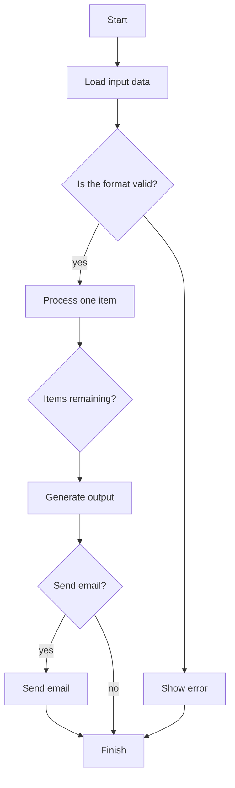

<p align="center">
  <a href="https://harumiweb.github.io/exstruct/">
    
  </a>
</p>

<p align="center">
  <em>Excel Structured Extraction Engine</em>
</p>

<div align="center" style="max-width: 600px; margin: auto;">

[](https://pypi.org/project/exstruct/) [](https://pepy.tech/projects/exstruct)  [](https://github.com/harumiWeb/exstruct/actions/workflows/pytest.yml) [](https://app.codacy.com/gh/harumiWeb/exstruct/dashboard?utm_source=gh&utm_medium=referral&utm_content=&utm_campaign=Badge_grade) [](https://codecov.io/gh/harumiWeb/exstruct) [](https://deepwiki.com/harumiWeb/exstruct) 

</div>

<p align="center">
  <a href="README.md">
    English
  </a>
   |
  <a href="README.ja.md">
    日本語
  </a>
</p>

# ExStruct — Excel Structured Extraction Engine

ExStruct reads Excel workbooks into structured data and applies patch-based
editing workflows through a shared core. It provides extraction APIs, a
JSON-first editing CLI, and an MCP server for host-managed integrations, with
options tuned for LLM/RAG preprocessing, reviewable edit flows, and local
automation.

- In COM/Excel environments (Windows), it performs rich extraction.
- In non-COM environments (Linux/macOS):
  - if the LibreOffice runtime is available, it performs best-effort extraction for cells, table candidates, shapes, connectors, and charts
  - otherwise, it safely falls back to cells + table candidates + print areas

Detection heuristics, editing workflows, and output modes are adjustable for
LLM/RAG pipelines and local automation.

## Choose an Interface

| Use case | Recommended interface | Why |
| --- | --- | --- |
| Write direct Python Excel-editing code | `openpyxl` / `xlwings` | Usually the better fit for imperative Python editing. Reach for `exstruct.edit` only when you specifically want ExStruct's patch contract in Python. |
| Run local operator or AI-agent edit workflows | `exstruct patch`, `make`, `ops`, `validate` | Canonical operational interface; JSON-first and dry-run friendly. |
| Run sandboxed or host-managed integrations | `exstruct-mcp` / MCP tools | Integration / compatibility layer that owns `PathPolicy`, transport, and artifact behavior. |

Extraction keeps the existing top-level Python API (`extract`, `process_excel`,
`ExStructEngine`) and the legacy `exstruct INPUT.xlsx ...` CLI entrypoint.

## Main Features

- **Excel -> structured JSON**: outputs cells, shapes, charts, SmartArt, table candidates, merged-cell ranges, print areas, and auto page-break areas by sheet or by area.
- **Output modes**: `light` (cells + table candidates + print areas only), `libreoffice` (best-effort non-COM mode for `.xlsx/.xlsm`; adds merged cells, shapes, connectors, and charts when the LibreOffice runtime is available), `standard` (Excel COM mode with texted shapes + arrows, charts, SmartArt, and merged-cell ranges), `verbose` (all shapes with width/height plus cell hyperlinks).
- **Formula extraction**: emits `formulas_map` (formula string -> cell coordinates) via openpyxl/COM. It is enabled by default in `verbose` and can be controlled with `include_formulas_map`.
- **Formats**: JSON (compact by default, `--pretty` for formatting), YAML, and TOON (optional dependencies).
- **Backend metadata is opt-in**: shape/chart `provenance`, `approximation_level`, and `confidence` are omitted from serialized output by default. Enable them with `--include-backend-metadata` or `include_backend_metadata=True`.
- **Workbook editing interfaces**: use the editing CLI for primary ExStruct edit flows, keep MCP for host-owned safety controls, and use `exstruct.edit` only when you need the same patch contract from Python.
- **Table detection tuning**: heuristics can be adjusted dynamically through the API.
- **Hyperlink extraction**: in `verbose` mode, or with `include_cell_links=True`, cell links are emitted in `links`.
- **CLI rendering**: in `standard` / `verbose`, PDF and sheet images can be generated when Excel COM is available.
- **Safe fallback**: if Excel COM or the LibreOffice runtime is unavailable, the process does not crash and falls back to cells + table candidates + print areas.

## Installation

```bash
pip install exstruct
```

Optional extras:

- YAML: `pip install pyyaml`
- TOON: `pip install python-toon`
- Rendering (PDF/PNG): Excel + `pip install pypdfium2 pillow` (`mode=libreoffice` is not supported)
- Install everything at once: `pip install exstruct[yaml,toon,render]`

Platform note:

- Full COM extraction for shapes/charts targets Windows + Excel (xlwings/COM). On Linux/macOS/server environments, use `mode=libreoffice` as the best-effort rich mode or `mode=light` for minimal extraction. `.xls` is not supported in `mode=libreoffice`.
- On Debian/Ubuntu/WSL, install LibreOffice together with `python3-uno`. ExStruct probes a compatible system Python automatically for `mode=libreoffice`; if your environment needs an explicit interpreter, set `EXSTRUCT_LIBREOFFICE_PYTHON_PATH=/usr/bin/python3`.
- LibreOffice Python detection now runs the bundled bridge in `--probe` mode before selection. An incompatible `EXSTRUCT_LIBREOFFICE_PYTHON_PATH` fails fast instead of surfacing a delayed bridge `SyntaxError` during extraction.
- If the isolated temporary LibreOffice profile fails before the UNO socket becomes ready, ExStruct retries once with the shared/default LibreOffice profile as a compatibility fallback and reports per-attempt startup detail if both launches fail.
- GitHub Actions includes dedicated LibreOffice smoke jobs on `ubuntu-24.04` and `windows-2025`. Linux installs `libreoffice` + `python3-uno`; Windows installs `libreoffice-fresh`, sets `EXSTRUCT_LIBREOFFICE_PATH`, and both jobs run `tests/core/test_libreoffice_smoke.py` with `RUN_LIBREOFFICE_SMOKE=1`.

## Quick Start CLI

```bash
exstruct input.xlsx > output.json          # compact JSON to stdout by default
exstruct input.xlsx -o out.json --pretty   # write pretty JSON to a file
exstruct input.xlsx --format yaml          # YAML (requires pyyaml)
exstruct input.xlsx --format toon          # TOON (requires python-toon)
exstruct input.xlsx --sheets-dir sheets/   # write one file per sheet
exstruct input.xlsx --auto-page-breaks-dir auto_areas/  # COM only; shown only when available
exstruct input.xlsx --alpha-col            # output column keys as A, B, ..., AA
exstruct input.xlsx --include-backend-metadata  # include shape/chart backend metadata
exstruct input.xlsx --mode light           # cells + table candidates only
exstruct input.xlsx --mode libreoffice     # best-effort extraction of shapes/connectors/charts without COM
exstruct input.xlsx --pdf --image          # PDF and PNGs (Excel COM required)
```

Auto page-break export is available from both the API and the CLI when Excel/COM is available. The CLI exposes `--auto-page-breaks-dir` only in COM-capable environments.
`mode=libreoffice` rejects `--pdf`, `--image`, and `--auto-page-breaks-dir` early. Use `standard` or `verbose` with Excel COM for those features.
By default, the CLI keeps legacy 0-based numeric string column keys (`"0"`, `"1"`, ...). Use `--alpha-col` when you need Excel-style keys (`"A"`, `"B"`, ...).
By default, serialized shape/chart output omits backend metadata (`provenance`, `approximation_level`, `confidence`) to reduce token usage. Use `--include-backend-metadata` or the corresponding Python/MCP option when you need it.
Note: MCP `exstruct_extract` defaults to `options.alpha_col=true`, which differs from the CLI default (`false`).

## Quick Start Editing CLI

```bash
exstruct patch --input book.xlsx --ops ops.json --backend openpyxl
exstruct patch --input book.xlsx --ops - --dry-run --pretty < ops.json
exstruct make --output new.xlsx --ops ops.json --backend openpyxl
exstruct ops list
exstruct ops describe create_chart --pretty
exstruct validate --input book.xlsx --pretty
```

- `patch` and `make` print JSON `PatchResult` to stdout.
- This is the canonical operational / agent interface for workbook editing.
- `ops list` / `ops describe` expose the public patch-op schema.
- `validate` reports workbook readability (`is_readable`, `warnings`, `errors`).
- Phase 2 keeps the legacy extraction CLI unchanged; it does not add
  `exstruct extract` or interactive safety flags yet.

Recommended edit flow:

1. Build patch ops.
2. Run `exstruct patch --dry-run` and inspect `PatchResult`, warnings, and diff.
3. Pin `--backend openpyxl` when you want the dry run and the real apply to use the same engine.
4. If you keep `--backend auto`, inspect `PatchResult.engine`; on Windows/Excel hosts the real apply may switch to COM.
5. Re-run without `--dry-run` only after the result is acceptable.

## MCP Server (stdio)

MCP is the integration / compatibility layer around the same editing core. Use
it when you need host-managed path restrictions, transport mapping, artifact
mirroring, or approval-aware agent execution. For ordinary Python workbook
editing, `openpyxl` / `xlwings` are usually a better fit. For local shell or
agent workflows, prefer the editing CLI.

If you previously used `exstruct_patch` / `exstruct_make` only because editing
was MCP-first, migrate new local workflows to `exstruct patch` or
`exstruct make` unless you specifically need MCP host controls or the shared
patch contract inside Python.

### Quick Start with `uvx` (recommended)

You can run it directly without installation:

```bash
uvx --from 'exstruct[mcp]' exstruct-mcp --root C:\data --log-file C:\logs\exstruct-mcp.log --on-conflict rename
```

Benefits:

- no `pip install` required
- automatic dependency management
- isolated environment
- easy version pinning: `uvx --from 'exstruct[mcp]==0.4.4' exstruct-mcp`

### Traditional installation

You can also install it with pip:

```bash
pip install exstruct[mcp]
exstruct-mcp --root C:\data --log-file C:\logs\exstruct-mcp.log --on-conflict rename
```

Available tools:

- `exstruct_extract`
- `exstruct_capture_sheet_images`
- `exstruct_make`
- `exstruct_patch`
- `exstruct_read_json_chunk`
- `exstruct_read_range`
- `exstruct_read_cells`
- `exstruct_read_formulas`
- `exstruct_validate_input`

Notes:

- `exstruct_capture_sheet_images` is COM-only (Experimental) and supports optional `sheet` / `range` targeting (`A1:B2`, `Sheet1!A1:B2`, `'Sheet 1'!A1:B2`). When `out_dir` is omitted, it creates a unique `<workbook_stem>_images` directory under MCP `--root`.
- MCP server startup defaults `EXSTRUCT_RENDER_SUBPROCESS=1` via `setdefault`. If you want in-process execution instead, set `EXSTRUCT_RENDER_SUBPROCESS=0` before launching the server.
- Timeout tuning for `exstruct_capture_sheet_images`: `EXSTRUCT_MCP_CAPTURE_SHEET_IMAGES_TIMEOUT_SEC` (overall tool timeout), `EXSTRUCT_RENDER_SUBPROCESS_STARTUP_TIMEOUT_SEC` (worker startup), `EXSTRUCT_RENDER_SUBPROCESS_JOIN_TIMEOUT_SEC` (primary wait budget), and `EXSTRUCT_RENDER_SUBPROCESS_RESULT_TIMEOUT_SEC` (post-exit grace).
- Subprocess failures return `stage=startup|join|result|worker`, which lets MCP clients distinguish bootstrap failures, timeouts, and worker-side rendering failures.
- Trade-off of `EXSTRUCT_RENDER_SUBPROCESS=1`: extra subprocess startup/coordination overhead and more dependency on worker-side module resolution.
- Trade-off of `EXSTRUCT_RENDER_SUBPROCESS=0`: weaker crash isolation and higher memory pressure risk in long-running processes.
- Logs are written to stderr, and optionally to `--log-file`, to keep stdio responses clean.
- On Windows with Excel, `standard` / `verbose` use COM for the richest extraction.
- On Linux/macOS/server environments, `libreoffice` is the best-effort rich mode. It is not a strict subset of COM output; shapes, connectors, and charts are reconstructed from LibreOffice + OOXML metadata and may differ in fidelity.
- In v1, `libreoffice` does not render PDFs/PNGs and does not compute auto page-break areas.
- `exstruct_patch` supports `backend` selection.
  - `auto` (default): prefer COM when available, otherwise openpyxl
  - `com`: force COM (`dry_run` / `return_inverse_ops` / `preflight_formula_check` are not allowed)
  - `openpyxl`: force openpyxl (`.xls` is not supported)
- `create_chart` is COM-only. Requests that include `create_chart` cannot use `backend="openpyxl"`, and they also reject `dry_run`, `return_inverse_ops`, and `preflight_formula_check`.
- `create_chart` supports `chart_type` values `line`, `column`, `bar`, `area`, `pie`, `doughnut`, `scatter`, and `radar` (aliases: `column_clustered`, `bar_clustered`, `xy_scatter`, `donut`).
- `create_chart` accepts either a single range string or `list[str]` for `data_range`, and both `data_range` and `category_range` support sheet-qualified ranges such as `Sheet2!A1:B10` and `'Sales Data'!A1:B10`.
- `create_chart` also supports explicit titles with `chart_title`, `x_axis_title`, and `y_axis_title`.
- `create_chart` and `apply_table_style` can be combined in one request when the backend resolves to COM (`backend="com"` or COM-capable `backend="auto"`).
- For stable COM execution of `apply_table_style` on Windows, make sure desktop Excel is installed and runnable, and that the target `range` is a contiguous A1 range including the header row.
- `exstruct_patch` error details may include `error_code`, `failed_field`, and `raw_com_message`. Table-related codes include `table_style_invalid`, `list_object_add_failed`, and `com_api_missing`.
- `exstruct_patch` responses include the actual backend in `engine` (`com` / `openpyxl`). `restore_design_snapshot` remains openpyxl-only.
- Use `exstruct_make` for creating new workbooks and `exstruct_patch` for editing existing ones.
- `exstruct_make` creates a new workbook and applies `ops` in one call (`out_path` required, `ops` optional).
  - supported extensions: `.xlsx` / `.xlsm` / `.xls`
  - the initial sheet name is normalized to `Sheet1`
  - `.xls` requires COM, so `backend=openpyxl` is not allowed

MCP setup guide for each AI agent:

[MCP Server](https://harumiweb.github.io/exstruct/mcp/)

## Quick Start Python Extraction

```python
from pathlib import Path
from exstruct import extract, export, set_table_detection_params

# Tune table detection (optional)
set_table_detection_params(table_score_threshold=0.3, density_min=0.04)

# Modes: "light" / "standard" / "verbose"
wb = extract("input.xlsx", mode="standard")  # standard does not emit links by default
export(wb, Path("out.json"), pretty=False)  # compact JSON
export(wb, Path("out.json"), include_backend_metadata=True)  # opt into backend metadata

# Helpful model methods: iteration, indexing, and direct serialization
first_sheet = wb["Sheet1"]          # get a sheet with __getitem__
for name, sheet in wb:              # __iter__ yields (name, SheetData)
    print(name, len(sheet.rows))
wb.save("out.json", pretty=True)    # save WorkbookData based on extension
first_sheet.save("sheet.json")      # save SheetData the same way
print(first_sheet.to_yaml())        # YAML string (requires pyyaml)
print(first_sheet.to_json(include_backend_metadata=True))  # opt in when needed

# ExStructEngine: per-instance configuration
from exstruct import (
    DestinationOptions,
    ExStructEngine,
    FilterOptions,
    FormatOptions,
    OutputOptions,
    StructOptions,
    export_auto_page_breaks,
)

engine = ExStructEngine(
    options=StructOptions(mode="verbose"),  # verbose includes hyperlinks by default
    output=OutputOptions(
        format=FormatOptions(pretty=True),
        filters=FilterOptions(
            include_shapes=False,
            include_backend_metadata=True,
        ),  # opt into backend metadata when needed
        destinations=DestinationOptions(sheets_dir=Path("out_sheets")),  # save per-sheet files
    ),
)
wb2 = engine.extract("input.xlsx")
engine.export(wb2, Path("out_filtered.json"))

# Enable hyperlinks in standard mode
engine_links = ExStructEngine(options=StructOptions(mode="standard", include_cell_links=True))
with_links = engine_links.extract("input.xlsx")

# Export one file per print area
from exstruct import export_print_areas_as
export_print_areas_as(wb, "areas", fmt="json", pretty=True)

# Extract / export auto page-break areas (COM only; raises if no auto breaks exist)
engine_auto = ExStructEngine(
    output=OutputOptions(
        destinations=DestinationOptions(auto_page_breaks_dir=Path("auto_areas"))
    )
)
wb_auto = engine_auto.extract("input.xlsx")  # includes SheetData.auto_print_areas
engine_auto.export(wb_auto, Path("out_with_auto.json"))
export_auto_page_breaks(wb_auto, "auto_areas", fmt="json", pretty=True)
```

**Note (non-COM environments):** even when Excel COM is unavailable, cells + `table_candidates` are still returned, but `shapes` / `charts` will be empty.

## Table Detection Parameters

```python
from exstruct import set_table_detection_params

set_table_detection_params(
    table_score_threshold=0.35,  # raise it to be stricter
    density_min=0.05,
    coverage_min=0.2,
    min_nonempty_cells=3,
)
```

Higher values reduce false positives. Lower values reduce missed detections.

## Output Modes

- **light**: cells + table candidates only (no COM required).
- **standard**: texted shapes + arrows, charts (when COM is available), table candidates, and merged-cell ranges. Cell hyperlinks are emitted only when `include_cell_links=True`.
- **verbose**: all shapes (with width/height), charts, table candidates, merged-cell ranges, hyperlinks, `colors_map`, and `formulas_map`.

## Error Handling / Fallback

- If Excel COM is unavailable, extraction falls back to cells + table candidates automatically, and shapes/charts remain empty.
- If shape extraction fails, ExStruct still returns cells + table candidates and only emits a warning.
- The CLI writes errors to stdout/stderr and exits with a non-zero status on failure.

## Optional Rendering

Excel and `pypdfium2` are required:

```bash
exstruct input.xlsx --pdf --image --dpi 144
```

This writes `<output>.pdf` and PNG files under `<output>_images/`.

## Example 1: Excel Structuring Demo

To show how far exstruct can structure Excel, we parse an Excel workbook that combines the following three elements on a single sheet and show an LLM reasoning example based on the JSON output.

- a table (sales data)
- a line chart
- a flowchart built only with shapes

(The image below is the actual sample Excel sheet.)

Sample Excel: `sample/sample.xlsx`

### 1. Input: Excel Sheet Overview

This sample Excel contains the following data:

### 1) Table (sales data)

| Month  | Product A | Product B | Product C |
| ------ | --------- | --------- | --------- |
| Jan-25 | 120       | 80        | 60        |
| Feb-25 | 135       | 90        | 64        |
| Mar-25 | 150       | 100       | 70        |
| Apr-25 | 170       | 110       | 72        |
| May-25 | 160       | 120       | 75        |
| Jun-25 | 180       | 130       | 80        |

### 2) Chart (line chart)

- Title: Sales Data
- Series: Product A / Product B / Product C (six months)
- Y-axis: 0-200

### 3) Flowchart made with shapes

The sheet includes the following flow:

- Start / End
- Format check
- Loop (items remaining?)
- Error handling
- Yes/No decision for sending email

### 2. Output: structured JSON generated by exstruct (excerpt)

Below is a shortened JSON output example from parsing the workbook above.

```json
{
  "book_name": "sample.xlsx",
  "sheets": {
    "Sheet1": {
      "rows": [
        {
          "r": 3,
          "c": {
            "1": "月",
            "2": "製品A",
            "3": "製品B",
            "4": "製品C"
          }
        },
        ...
      ],
      "shapes": [
        {
          "id": 1,
          "text": "開始",
          "l": 148,
          "t": 220,
          "kind": "shape",
          "type": "AutoShape-FlowchartProcess"
        },
        {
          "id": 2,
          "text": "入力データ読み込み",
          "l": 132,
          "t": 282,
          "kind": "shape",
          "type": "AutoShape-FlowchartProcess"
        },
        {
          "l": 193,
          "t": 246,
          "kind": "arrow",
          "begin_arrow_style": 1,
          "end_arrow_style": 2,
          "begin_id": 1,
          "end_id": 2,
          "direction": "N"
        },
        ...
      ],
      "charts": [
        {
          "name": "Chart 1",
          "chart_type": "Line",
          "title": "売上データ",
          "y_axis_range": [
            0.0,
            200.0
          ],
          "series": [
            {
              "name": "製品A",
              "name_range": "Sheet1!$C$3",
              "x_range": "Sheet1!$B$4:$B$9",
              "y_range": "Sheet1!$C$4:$C$9"
            },
            ...
          ],
          "l": 377,
          "t": 25
        }
      ],
      "table_candidates": [
        "B3:E9"
      ]
    }
  }
}
```

### 3. How AI (Copilot / LLM) interprets the JSON

````md
Below is a Markdown reconstruction of the Excel workbook. It expresses the table, chart, and flowchart as separate structures.

---

## Sales Data Table

| Month      | Product A | Product B | Product C |
| ---------- | --------- | --------- | --------- |
| 2025-01-01 | 120       | 80        | 60        |
| 2025-02-01 | 135       | 90        | 64        |
| 2025-03-01 | 150       | 100       | 70        |
| 2025-04-01 | 170       | 110       | 72        |
| 2025-05-01 | 160       | 120       | 75        |
| 2025-06-01 | 180       | 130       | 80        |

---

## Sales Data (Line Chart)

- Chart title: **売上データ**
- Chart type: line chart
- Y-axis range: 0 to 200
- Data series:
  - Product A: 120 -> 135 -> 150 -> 170 -> 160 -> 180
  - Product B: 80 -> 90 -> 100 -> 110 -> 120 -> 130
  - Product C: 60 -> 64 -> 70 -> 72 -> 75 -> 80

---

## Process Flow (Mermaid Flowchart)


```mermaid
flowchart TD
    A[Start]
    B[Load input data]
    C{Is the format valid?}
    D[Process one item]
    E{Items remaining?}
    F[Generate output]
    G{Send email?}
    H[Show error]
    I[Send email]
    J[Finish]

    A --> B
    B --> C
    C -->|yes| D
    C --> H
    D --> E
    E --> F
    F --> G
    G -->|yes| I
    G -->|no| J
    H --> J
    I --> J
```
````

## Example 2: A General Application Form

### Excel data


### ExStruct JSON

(Truncated for brevity)

```json
{
  "book_name": "ja_form.xlsx",
  "sheets": {
    "Sheet1": {
      "rows": [
        { "r": 1, "c": { "0": "介護保険負担限度額認定申請書" } },
        {
          "r": 3,
          "c": { "0": "（申請先）", "7": "  　　　　年　　　　月　　　　日" }
        },
        { "r": 4, "c": { "1": "X市長　" } },
        ...
      ],
      "table_candidates": ["B25:C26", "C37:D50"],
      "merged_cells": {
        "schema": ["r1", "c1", "r2", "c2", "v"],
        "items": [
          [55, 5, 55, 10, "申請者が被保険者本人の場合には、下記について記載は不要です。"],
          [54, 8, 54, 10, " "],
          [51, 5, 52, 6, "有価証券"],
          ...
        ]
      }
    }
  }
}
```

### ExStruct JSON -> Markdown via LLM reasoning

```md
# Long-Term Care Insurance Burden Limit Certification Application

(Submitted to)                                    Year    Month    Day
Mayor of City X

Attach the related documents below and apply for certification of the burden limit for food and housing expenses.

---

## Insured Person Information

| Item | Value |
| ---- | ----- |
| Furigana | |
| Name | |
| Insured Person Number | |
| Personal Number | |
| Date of Birth | Meiji / Taisho / Showa Year Month Day |
| Address | |
| Contact | |

---

## Long-Term Care Facility Entered / Hospitalized In

| Item | Value |
| ---- | ----- |
| Facility name / location | |
| Contact | |
| Date of entry / admission | Year Month Day |

If the applicant has not entered a care insurance facility, or uses short stay only, this section is not required.

---

## Presence of a Spouse

| Item | Value |
| ---- | ----- |
| Spouse | Yes / No |

If "No", the following spouse section is not required.

---

## Notes

1. In this application, "spouse" includes a spouse living separately and a common-law partner.
2. If you own multiple assets of the same kind, list all of them and attach copies of bankbooks or equivalent documents.
3. If there is not enough space, write on the margin or on a separate sheet and attach it.
4. If benefits are obtained through a false declaration, the paid amount and up to twice that amount as an additional charge may need to be repaid under Article 22, Paragraph 1 of the Long-Term Care Insurance Act.
```

## Discussion

The result above shows the following clearly:

**ExStruct JSON is already in a format that AI can understand semantically as-is.**

Other LLM inference samples built with this library are available in the following directories:

- [Basic Excel](sample/basic/)
- [Flowchart](sample/flowchart/)
- [Gantt Chart](sample/gantt_chart/)
- [Application forms with many merged cells](sample/forms_with_many_merged_cells/)

### 4. Summary

This benchmark demonstrates that the library can:

- analyze tables, charts, and shapes (flowcharts) at the same time
- convert Excel's semantic structure into JSON
- let AI/LLMs read that JSON directly and reconstruct workbook content

In short, **exstruct = "an engine that converts Excel into a format AI can understand."**

## Benchmark


This repository includes benchmark reports focused on RAG/LLM preprocessing of Excel documents.
We track two perspectives: (1) core extraction accuracy and (2) reconstruction utility for downstream structure queries (RUB).
See `benchmark/REPORT.md` for the working summary and `benchmark/public/REPORT.md` for the public bundle.
Current results are based on n=12 cases and will be expanded further.

## Notes

- Default JSON is compact to reduce token usage. Use `--pretty` / `pretty=True` when readability matters.
- The field name is `table_candidates` (replacing the old `tables`). Adjust downstream schemas accordingly.

## Enterprise Use

ExStruct is intended primarily for **library** use, not as a service.

- no official support or SLA is provided
- long-term stability is prioritized over rapid feature growth
- enterprise use is expected to involve forking or internal customization

It is suitable for teams that:

- need transparency instead of black-box tooling
- are comfortable maintaining internal forks when needed

## Print Areas and Auto Page-Break Areas (PrintArea / PrintAreaView)

- `SheetData.print_areas` contains print areas (cell coordinates) in `light` / `standard` / `verbose`.
- `SheetData.auto_print_areas` contains Excel COM-computed auto page-break areas only when auto page-break extraction is enabled (COM only).
- Use `export_print_areas_as(...)` or CLI `--print-areas-dir` to export one file per print area. If no print areas exist, nothing is written.
- Use CLI `--auto-page-breaks-dir` (COM only), `DestinationOptions.auto_page_breaks_dir` (recommended), or `export_auto_page_breaks(...)` to export one file per auto page-break area. `export_auto_page_breaks(...)` raises `ValueError` when no auto page breaks exist.
- `PrintAreaView` includes rows and table candidates inside the area, plus shapes/charts that intersect the area. When shape size is unknown, point-based overlap is used. With `normalize=True`, row/column indices are rebased to the area origin.

## Architecture

ExStruct adopts a pipeline-oriented architecture that separates extraction strategy (Backend), orchestration (Pipeline), and semantic modeling.

See: [dev-docs/architecture/pipeline.md](dev-docs/architecture/pipeline.md)

## Contributing

If you plan to extend ExStruct internals, read the contributor architecture guide first.

See: [dev-docs/architecture/contributor-guide.md](dev-docs/architecture/contributor-guide.md)

## Coverage Note

The cell-structure inference logic (`cells.py`) depends on heuristic rules and Excel-specific behavior. Full coverage is intentionally not pursued, because exhaustive tests would not reflect real-world reliability.

## License

BSD-3-Clause. See `LICENSE` for details.

## Documentation

- API reference (GitHub Pages): https://harumiweb.github.io/exstruct/
- JSON schemas are stored in `schemas/`, one file per model. Regenerate them with `python scripts/gen_json_schema.py` after model changes.

## Star History

[](https://www.star-history.com/?repos=harumiWeb%2Fexstruct&type=date&legend=top-left)
