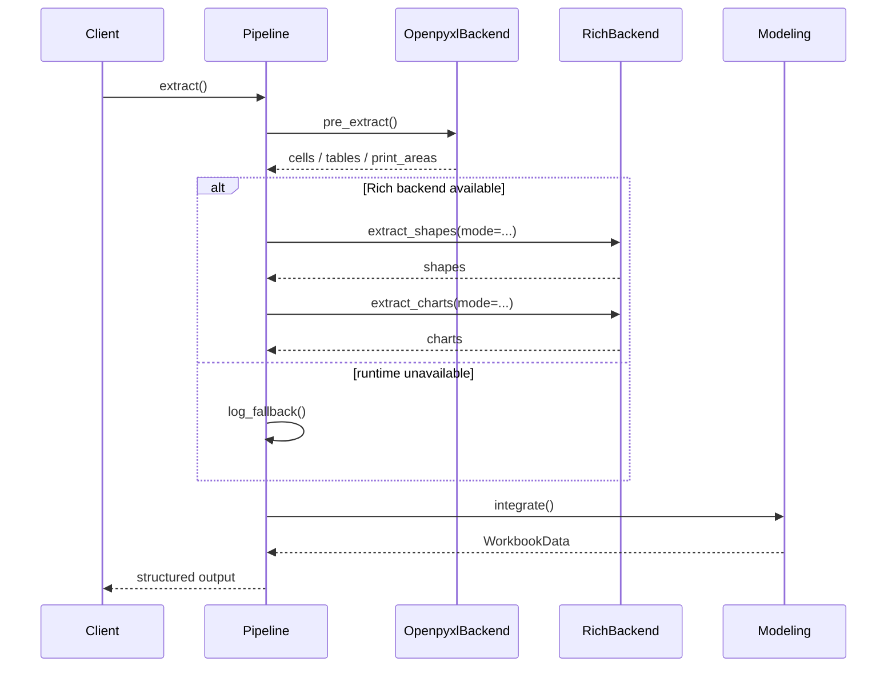

# Pipeline Architecture Overview

ExStruct uses a three-layer **Pipeline + Backend + Modeling** architecture
to convert Excel workbooks into **semantically structured JSON**.

This design achieves the following.

- Separation of Excel COM-dependent logic from non-dependent logic
- Future extensibility to direct OpenXML/XML parsing
- Stable output for RAG/LLM use cases

---

## End-to-End Flow

The processing order is as follows.

`RichBackend` in this diagram refers to the conceptual rich-extraction layer; the concrete implementations are `ComRichBackend` and `LibreOfficeRichBackend`.

1. **Pipeline** assembles the execution plan
2. **Openpyxl Backend** performs pre-analysis (cells, tables, print areas)
3. **Rich Backend** extracts shapes/charts if available. Here, `RichBackend` is the conceptual layer and `ComRichBackend` / `LibreOfficeRichBackend` are the concrete implementations.
4. **Modeling** integrates the results into WorkbookData / SheetData
5. Output in the requested format (JSON / YAML / TOON)

---

## Pipeline Responsibilities

Pipeline is the **orchestrator**.

- Determines the extraction order
- Selects backends
- Controls fallback paths
- Manages intermediate artifacts

Pipeline is designed to **never read Excel content directly**.

---

## Backend Responsibilities

Backend defines **how Excel is read**.

| Backend                | Responsibilities                                  |
| ---------------------- | ------------------------------------------------- |
| OpenpyxlBackend        | Cells / tables / print areas / colors map         |
| ComBackend             | COM-only print areas / auto page breaks / maps    |
| ComRichBackend         | Shapes / arrows / charts / SmartArt via Excel COM |
| LibreOfficeRichBackend | Best-effort shapes / connectors / charts          |

In this document, `RichBackend` refers to the protocol-level concept, while `ComRichBackend` and `LibreOfficeRichBackend` are the concrete backend classes.

This abstraction enables the following extensions.

- Direct XML parsing backend
- LibreOffice backend
- Remote Excel service backend

All of these can be added **without major changes to the Pipeline**.

---

## Fallback Design

When COM or LibreOffice runtime is unavailable, the following must be respected.

- Do not take down the entire process with an exception
- Reuse openpyxl results as much as possible
- Record the fallback reason explicitly

This is an intentional design that assumes **batch processing, CI, and automation**.

---

## Modeling Layer Responsibilities

Modeling is responsible for:

- Integrating results from multiple backends
- Producing normalized WorkbookData / SheetData
- Not depending on the output format itself

**Semantic structure models** for RAG/LLM use are centralized here.

---

## Why This Design

- Excel has separate worlds of cells, shapes, and charts
- COM is powerful but fragile
- LLMs require stable structured data

Therefore, **pipeline separation** is the most practical approach.
