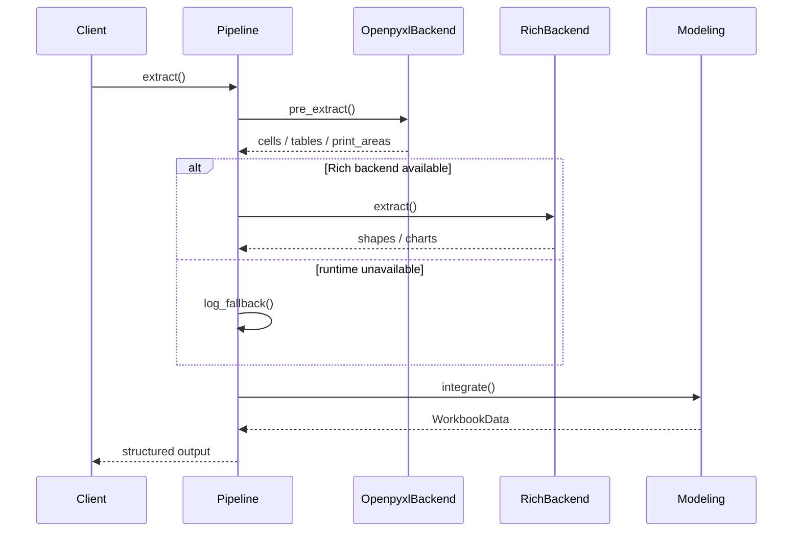

# Pipeline アーキテクチャ概要

ExStruct は Excel workbook を **意味構造化 JSON** に変換するために、
**Pipeline + Backend + Modeling** の三層構成を採用している。

この設計により、次を実現する。

- Excel COM 依存ロジックと非依存ロジックの分離
- OpenXML/XML 直接解析への将来的な拡張
- RAG/LLM 用途での安定した出力

---

## エンドツーエンドの流れ

処理順は次のとおり。

1. **Pipeline** が実行計画を組み立てる
2. **Openpyxl Backend** が事前解析を行う（cells, tables, print areas）
3. **Rich Backend** が利用可能なら shapes/charts を抽出する（`ComBackend` または `LibreOfficeRichBackend`）
4. **Modeling** が結果を WorkbookData / SheetData に統合する
5. 要求された形式（JSON / YAML / TOON）で出力する

---

## Pipeline の責務

Pipeline は **司令塔** である。

- 抽出順序を決める
- backend を選択する
- fallback path を制御する
- 中間 artifact を管理する

Pipeline は **Excel 内容を直接読まない** 設計とする。

---

## Backend の責務

Backend は **どう Excel を読むか** を定義する。

| Backend                | Responsibilities                                  |
| ---------------------- | ------------------------------------------------- |
| OpenpyxlBackend        | Cells / tables / print areas / colors map         |
| ComBackend             | COM-only print areas / auto page breaks / maps    |
| ComRichBackend         | Shapes / arrows / charts / SmartArt via Excel COM |
| LibreOfficeRichBackend | Best-effort shapes / connectors / charts          |

この抽象化により、次の拡張が可能になる。

- XML 直接解析 backend
- LibreOffice backend
- Remote Excel service backend

いずれも **Pipeline を大きく変えずに** 追加できる。

---

## フォールバック設計

COM または LibreOffice runtime が使えない場合は、次を守る。

- 例外で全体を落とさない
- Openpyxl の結果をできるだけ再利用する
- fallback reason を明示的に記録する

これは **batch processing, CI, automation** を前提にした意図的な設計である。

---

## Modeling 層の責務

Modeling は次を担当する。

- 複数 backend の結果を統合する
- 正規化済みの WorkbookData / SheetData を生成する
- 出力形式そのものには依存しない

RAG/LLM 用の **意味構造モデル** はここに集約する。

---

## なぜこの設計か

- Excel には cells, shapes, charts という別世界がある
- COM は強力だが壊れやすい
- LLM は安定した構造化データを必要とする

そのため、**pipeline separation** が最も実用的である。
