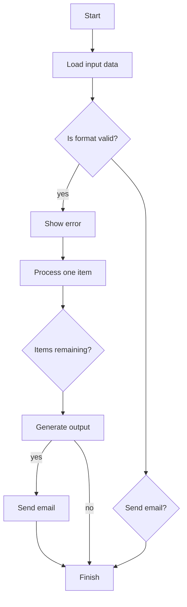

# ExStruct — Excel Structured Extraction Engine

[](https://pypi.org/project/exstruct/) [](https://pepy.tech/projects/exstruct)  [](https://github.com/harumiWeb/exstruct/actions/workflows/pytest.yml) [](https://app.codacy.com/gh/harumiWeb/exstruct/dashboard?utm_source=gh&utm_medium=referral&utm_content=&utm_campaign=Badge_grade) [](https://codecov.io/gh/harumiWeb/exstruct)


ExStruct reads Excel workbooks and outputs structured data (cells, table candidates, shapes, charts, smartart, merged cell ranges, print areas/views, auto page-break areas, hyperlinks) as JSON by default, with optional YAML/TOON formats. It targets both COM/Excel environments (rich extraction) and non-COM environments (cells + table candidates + print areas), with tunable detection heuristics and multiple output modes to fit LLM/RAG pipelines.

[日本版 README](README.ja.md)

## Features

- **Excel → Structured JSON**: cells, shapes, charts, smartart, table candidates, print areas/views, and auto page-break areas per sheet.
- **Output modes**: `light` (cells + table candidates + print areas; no COM, shapes/charts empty), `standard` (texted shapes + arrows, charts, smartart, merged cell ranges, print areas), `verbose` (all shapes with width/height, charts with size, merged cell ranges, print areas). Verbose also emits cell hyperlinks, `colors_map`, and `formulas_map`. Size output is flag-controlled.
- **Formula map extraction**: emits `formulas_map` (formula string -> cell coordinates) via openpyxl/COM; enabled by default in `verbose` or via `include_formulas_map`.
- **Auto page-break export (COM only)**: capture Excel-computed auto page breaks and write per-area JSON/YAML/TOON when requested (CLI option appears only when COM is available).
- **Formats**: JSON (compact by default, `--pretty` available), YAML, TOON (optional dependencies).
- **Table detection tuning**: adjust heuristics at runtime via API.
- **CLI rendering** (Excel required): optional PDF and per-sheet PNGs.
- **Graceful fallback**: if Excel COM is unavailable, extraction falls back to cells + table candidates without crashing.

## Installation

```bash
pip install exstruct
```

Optional extras:

- YAML: `pip install pyyaml`
- TOON: `pip install python-toon`
- Rendering (PDF/PNG): Excel + `pip install pypdfium2 pillow`
- All extras at once: `pip install exstruct[yaml,toon,render]`

Platform note:

- Full extraction (shapes/charts) targets Windows + Excel (COM via xlwings). On other platforms, use `mode=light` to get cells + `table_candidates`.

## Quick Start (CLI)

```bash
exstruct input.xlsx > output.json          # compact JSON to stdout (default)
exstruct input.xlsx -o out.json --pretty   # pretty JSON to a file
exstruct input.xlsx --format yaml          # YAML (needs pyyaml)
exstruct input.xlsx --format toon          # TOON (needs python-toon)
exstruct input.xlsx --sheets-dir sheets/   # split per sheet in chosen format
exstruct input.xlsx --auto-page-breaks-dir auto_areas/  # COM only; option appears when available
exstruct input.xlsx --print-areas-dir areas/  # split per print area (if any)
exstruct input.xlsx --mode light           # cells + table candidates only
exstruct input.xlsx --pdf --image          # PDF and PNGs (Excel required)
```

Auto page-break exports are available via API and CLI when Excel/COM is available; the CLI exposes `--auto-page-breaks-dir` only in COM-capable environments.

## Quick Start (Python)

```python
from pathlib import Path
from exstruct import extract, export, set_table_detection_params

# Tune table detection (optional)
set_table_detection_params(table_score_threshold=0.3, density_min=0.04)

# Extract with modes: "light", "standard", "verbose"
wb = extract("input.xlsx", mode="standard")
export(wb, Path("out.json"), pretty=False)  # compact JSON

# Model helpers: iterate, index, and serialize directly
first_sheet = wb["Sheet1"]           # __getitem__ access
for name, sheet in wb:               # __iter__ yields (name, SheetData)
    print(name, len(sheet.rows))
wb.save("out.json", pretty=True)     # WorkbookData → file (by extension)
first_sheet.save("sheet.json")       # SheetData → file (by extension)
print(first_sheet.to_yaml())         # YAML text (requires pyyaml)

# ExStructEngine: per-instance options (nested configs)
from exstruct import (
    DestinationOptions,
    ExStructEngine,
    FilterOptions,
    FormatOptions,
    OutputOptions,
    StructOptions,
    export_auto_page_breaks,
)

engine = ExStructEngine(
    options=StructOptions(mode="verbose"),  # verbose includes hyperlinks by default
    output=OutputOptions(
        format=FormatOptions(pretty=True),
        filters=FilterOptions(include_shapes=False),  # drop shapes in output
        destinations=DestinationOptions(sheets_dir=Path("out_sheets")),  # also write per-sheet files
    ),
)
wb2 = engine.extract("input.xlsx")
engine.export(wb2, Path("out_filtered.json"))

# Enable hyperlinks in standard mode
engine_links = ExStructEngine(options=StructOptions(mode="standard", include_cell_links=True))
with_links = engine_links.extract("input.xlsx")

# Export per print area (if print areas exist)
from exstruct import export_print_areas_as
export_print_areas_as(wb, "areas", fmt="json", pretty=True)

# Auto page-break extraction/output (COM only; raises if no auto breaks exist)
engine_auto = ExStructEngine(
    output=OutputOptions(
        destinations=DestinationOptions(auto_page_breaks_dir=Path("auto_areas"))
    )
)
wb_auto = engine_auto.extract("input.xlsx")  # includes SheetData.auto_print_areas
engine_auto.export(wb_auto, Path("out_with_auto.json"))  # also writes auto_areas/*
export_auto_page_breaks(wb_auto, "auto_areas", fmt="json", pretty=True)  # manual writer
```

**Note (non-COM environments):** If Excel COM is unavailable, extraction still runs and returns cells + `table_candidates`; `shapes`/`charts` will be empty.

## Table Detection Tuning

```python
from exstruct import set_table_detection_params

set_table_detection_params(
    table_score_threshold=0.35,  # increase to be stricter
    density_min=0.05,
    coverage_min=0.2,
    min_nonempty_cells=3,
)
```

Use higher thresholds to reduce false positives; lower them if true tables are missed.

## Output Modes

- **light**: cells + table candidates (no COM needed).
- **standard**: texted shapes + arrows, charts (COM if available), merged cell ranges, table candidates. Hyperlinks are off unless `include_cell_links=True`.
- **verbose**: all shapes (with width/height), charts, merged cell ranges, table candidates, cell hyperlinks, `colors_map`, and `formulas_map`.

## Error Handling / Fallbacks

- Excel COM unavailable → falls back to cells + table candidates; shapes/charts empty.
- Shape extraction failure → logs warning, still returns cells + table candidates.
- CLI prints errors to stdout/stderr and returns non-zero on failures.

## Optional Rendering

Requires Excel and `pypdfium2`.

```bash
exstruct input.xlsx --pdf --image --dpi 144
```

Creates `<output>.pdf` and `<output>_images/` PNGs per sheet.

## Example 1: Excel Structuring Demo

To show how well exstruct can structure Excel, we parse a workbook that combines three elements on one sheet and share an AI reasoning benchmark that uses the JSON output.

- Table (sales data)
- Line chart
- Flowchart built only with shapes

(Screenshot below is the actual sample Excel sheet)

Sample workbook: `sample/sample.xlsx`

### 1. Input: Excel Sheet Overview

This sample Excel contains:

### ① Table (Sales Data)

| Month  | Product A | Product B | Product C |
| ------ | --------- | --------- | --------- |
| Jan-25 | 120       | 80        | 60        |
| Feb-25 | 135       | 90        | 64        |
| Mar-25 | 150       | 100       | 70        |
| Apr-25 | 170       | 110       | 72        |
| May-25 | 160       | 120       | 75        |
| Jun-25 | 180       | 130       | 80        |

### ② Chart (Line Chart)

- Title: Sales Data
- Series: Product A / Product B / Product C (six months)
- Y axis: 0–200

### ③ Flowchart built with shapes

The sheet includes this flow:

- Start / End
- Format check
- Loop (items remaining?)
- Error handling
- Yes/No decision for sending email

### 2. Output: Structured JSON produced by exstruct (excerpt)

Below is a **shortened JSON output example** from parsing this Excel workbook.

```json
{
  "book_name": "sample.xlsx",
  "sheets": {
    "Sheet1": {
      "rows": [
        {
          "r": 3,
          "c": {
            "1": "月",
            "2": "製品A",
            "3": "製品B",
            "4": "製品C"
          }
        },
        ...
      ],
      "shapes": [
        {
          "id": 1,
          "text": "開始",
          "l": 148,
          "t": 220,
          "kind": "shape",
          "type": "AutoShape-FlowchartProcess"
        },
        {
          "id": 2,
          "text": "入力データ読み込み",
          "l": 132,
          "t": 282,
          "kind": "shape",
          "type": "AutoShape-FlowchartProcess"
        },
        {
          "l": 193,
          "t": 246,
          "kind": "arrow",
          "begin_arrow_style": 1,
          "end_arrow_style": 2,
          "begin_id": 1,
          "end_id": 2,
          "direction": "N"
        },
        ...
      ],
      "charts": [
        {
          "name": "Chart 1",
          "chart_type": "Line",
          "title": "売上データ",
          "y_axis_range": [
            0.0,
            200.0
          ],
          "series": [
            {
              "name": "製品A",
              "name_range": "Sheet1!$C$3",
              "x_range": "Sheet1!$B$4:$B$9",
              "y_range": "Sheet1!$C$4:$C$9"
            },
            ...
          ],
          "l": 377,
          "t": 25
        }
      ],
      "table_candidates": [
        "B3:E9"
      ]
    }
  }
}
```

### 3. How AI (Copilot / LLM) interprets the JSON

````md
Below is the Markdown reconstruction of the Excel workbook. The table, chart, and flowchart are all represented.

---

## 📊 Sales Data Table

| Month      | Product A | Product B | Product C |
| ---------- | --------- | --------- | --------- |
| 2025-01-01 | 120       | 80        | 60        |
| 2025-02-01 | 135       | 90        | 64        |
| 2025-03-01 | 150       | 100       | 70        |
| 2025-04-01 | 170       | 110       | 72        |
| 2025-05-01 | 160       | 120       | 75        |
| 2025-06-01 | 180       | 130       | 80        |

---

## 📈 Sales Data (Line Chart)

- Chart title: **売上データ (Sales Data)**
- Chart type: Line
- Y-axis range: 0 to 200
- Data series:
  - Product A: 120 → 135 → 150 → 170 → 160 → 180
  - Product B: 80 → 90 → 100 → 110 → 120 → 130
  - Product C: 60 → 64 → 70 → 72 → 75 → 80

---

## 🔄 Process Flow (Mermaid Flowchart)


````


## Example 2: General Application Form

### Excel Sheet


### ExStruct JSON

(Truncated for brevity)

```json
{
  "book_name": "en_sf425.xlsx",
  "sheets": {
    "FFR": {
      "rows": [
        { "r": 1, "c": { "0": "FEDERAL FINANCIAL REPORT" } },
        { "r": 3, "c": { "0": "(Follow form instructions)" } },
        {
          "r": 4,
          "c": {
            "0": "1.  Federal Agency and Organizational Element",
            "5": "2.  Federal Grant or Other Identifying Number Assigned by Federal Agency",
            "20": "Page",
            "23": " of"
          }
        },
        ...
      ],
      "shapes": [
        {
          "id": 1,
          "text": "Not Required by EPA",
          "l": 575,
          "t": 396,
          "kind": "shape",
          "type": "AutoShape-Rectangle"
        }
      ],
      "print_areas": [{ "r1": 1, "c1": 0, "r2": 66, "c2": 23 }],
      "merged_cells": {
        "schema": ["r1", "c1", "r2", "c2", "v"],
        "items": [
          [34, 15, 34, 23, " "],
          [56, 10, 57, 17, "Federal Share Calculation"],
          [18, 10, 18, 23, " "],
          [15, 0, 15, 1, " "],
          ...
        ]
      }
    }
  }
}

```

### Migration note (v0.3.5): merged_cells format change

`merged_cells` changed from a list of objects to a schema/items structure in v0.3.5 (breaking change for JSON consumers).

Old format (<= v0.3.2):

```json
"merged_cells": [
  { "r1": 34, "c1": 15, "r2": 34, "c2": 23, "v": " " },
  { "r1": 56, "c1": 10, "r2": 57, "c2": 17, "v": "Federal Share Calculation" }
]
```

New format (v0.3.5+):

```json
"merged_cells": {
  "schema": ["r1", "c1", "r2", "c2", "v"],
  "items": [
    [34, 15, 34, 23, " "],
    [56, 10, 57, 17, "Federal Share Calculation"]
  ]
}
```

Migration example (support both during transition):

```python
def normalize_merged_cells(raw):
    schema = ["r1", "c1", "r2", "c2", "v"]
    if isinstance(raw, list):
        items = [[d.get(k, " ") for k in schema] for d in raw]
        return {"schema": schema, "items": items}
    if isinstance(raw, dict) and "schema" in raw and "items" in raw:
        return raw
    return None
```

### LLM reconstruction example

```md
<!-- This is a structured interpretation, not an official reproduction. -->

# **Federal Financial Report (FFR)**

_(Follow form instructions)_

---

## **1. Federal Agency and Organizational Element**

**United States Environmental Protection Agency**

## **2. Federal Grant or Other Identifying Number Assigned by Federal Agency**

**Page 1 of pages**

---

## **3. Recipient Organization**

_(Name and complete address including Zip code)_

---

## **4. Recipient Identifiers**

- **4a. DUNS Number**
- **4b. EIN**
- **5. Recipient Account Number or Identifying Number**  
  _(To report multiple grants, use FFR Attachment)_
- **6. Report Type**
  - □ Quarterly
  - □ Semi-Annual
  - □ Annual
  - □ Final
- **7. Basis of Accounting**
  - □ Cash
  - □ Accrual

---

## **8. Project/Grant Period**

- **From:** (Month, Day, Year)
- **To:** (Month, Day, Year)

## **9. Reporting Period End Date**

(Month, Day, Year)

---

# **10. Transactions**

_(Use lines a–c for single or multiple grant reporting)_

### **Federal Cash**

_(To report multiple grants, also use FFR Attachment)_

- **a. Cash Receipts**
- **b. Cash Disbursements**
- **c. Cash on Hand** (line a minus b)

_(Use lines d–o for single grant reporting)_

### **Federal Expenditures and Unobligated Balance**

- **d. Total Federal funds authorized**
- **e. Federal share of expenditures**
- **f. Federal share of unliquidated obligations** — 0
- **g. Total Federal share** (sum of lines e and f) — 0
- **h. Unobligated balance of Federal funds** (line d minus g) — 0

### **Recipient Share**

- **i. Total recipient share required**
- **j. Recipient share of expenditures**
- **k. Remaining recipient share to be provided** (line i minus j) — 0

### **Program Income**

- **l. Total Federal program income earned**
- **m. Program income expended (deduction alternative)**
- **n. Program income expended (addition alternative)**
- **o. Unexpended program income** (line l minus line m or line n)

---

# **11. Indirect Expense**

| Type           | Rate | Period From | Period To | Base | Amount Charged | Federal Share |
| -------------- | ---- | ----------- | --------- | ---- | -------------- | ------------- |
|                |      |             |           |      |                |               |
| **g. Totals:** |      |             |           | 0    | 0              | 0             |

---

# **12. Remarks**

Attach any explanations deemed necessary or information required by the Federal sponsoring agency in compliance with governing legislation.

---

# **13. Certification**

By signing this report, I certify that it is true, complete, and accurate to the best of my knowledge.  
I am aware that any false, fictitious, or fraudulent information may subject me to criminal, civil, or administrative penalties.  
_(U.S. Code, Title 18, Section 1001)_

- **a. Typed or Printed Name and Title of Authorized Certifying Official**
- **b. Signature of Authorized Certifying Official**
- **c. Telephone** (Area code, number, extension)
- **d. Email address**
- **e. Date Report Submitted** (Month, Day, Year)

---

# **14. Agency Use Only**

**Federal Share Calculation**

---

### **Standard Form 425**

**OMB Approval Number:** 0348-0061  
**Expiration Date:** 02/28/2015

---

# **Paperwork Burden Statement**

According to the Paperwork Reduction Act, as amended, no persons are required to respond to a collection of information unless it displays a valid OMB Control Number.  
The valid OMB control number for this information collection is **0348-0061**.

Public reporting burden for this collection of information is estimated to average **1.5 hours per response**, including time for reviewing instructions, searching existing data sources, gathering and maintaining the data needed, and completing and reviewing the collection of information.

Send comments regarding the burden estimate or any other aspect of this collection of information, including suggestions for reducing this burden, to:

**Office of Management and Budget**  
Paperwork Reduction Project (0348-0060)  
Washington, DC 20503

---

### **Shape in Original Document**

- _Not Required by EPA_
```

From this we can see:

**exstruct's JSON is already in a format that AI can read and reason over directly.**

Other LLM inference samples using this library can be found in the following directory:

- [Basic Excel](sample/basic/)
- [Flowchart](sample/flowchart/)
- [Gantt Chart](sample/gantt_chart/)
- [Application forms with many merged cells](sample/forms_with_many_merged_cells/)

### 4. Summary

This benchmark confirms exstruct can:

- **Parse tables, charts, and shapes (flowcharts) simultaneously**
- Convert the semantic structure of Excel into JSON
- Let AI/LLMs read that JSON directly and reconstruct the workbook contents

In short, **exstruct = “an engine that converts Excel into a format AI can understand.”**

## Notes

- Default JSON is compact to reduce tokens; use `--pretty` or `pretty=True` when readability matters.
- Field `table_candidates` replaces `tables`; adjust downstream consumers accordingly.

## Enterprise Use

ExStruct is used primarily as a **library**, not a service.

- No official support or SLA is provided
- Long-term stability is prioritized over rapid feature growth
- Forking and internal modification are expected in enterprise use

This project is suitable for teams that:

- need transparency over black-box tools
- are comfortable maintaining internal forks if necessary

## Print Areas and Auto Page Breaks (PrintArea / PrintAreaView)

- `SheetData.print_areas` holds print areas (cell coordinates) in light/standard/verbose.
- `SheetData.auto_print_areas` holds Excel COM-computed auto page-break areas when auto page-break extraction is enabled (COM only).
- Use `export_print_areas_as(...)` or CLI `--print-areas-dir` to write one file per print area (nothing is written if none exist).
- Use CLI `--auto-page-breaks-dir` (COM only), `DestinationOptions.auto_page_breaks_dir` (preferred), or `export_auto_page_breaks(...)` to write per-auto-page-break files; the API raises `ValueError` if no auto page breaks exist.
- `PrintAreaView` includes rows and table candidates inside the area, plus shapes/charts that overlap the area (size-less shapes are treated as points). `normalize=True` rebases row/col indices to the area origin.

## Documentation build

- Update generated model docs before building the site: `python scripts/gen_model_docs.py`.
- Build locally with mkdocs + mkdocstrings (dev deps required): `uv run mkdocs serve` or `uv run mkdocs build`.

## Architecture

ExStruct uses a pipeline-based architecture that separates
extraction strategy (Backend) from orchestration (Pipeline)
and semantic modeling.

→ See: [docs/architecture/pipeline.md](docs/architecture/pipeline.md)

## Contributing

If you plan to extend ExStruct internals,
please read the contributor architecture guide.

→ [docs/contributors/architecture.md](docs/contributors/architecture.md)

## Note on coverage

The cell-structure inference logic (cells.py) relies on heuristic rules
and Excel-specific behaviors. Full coverage is intentionally not pursued,
as exhaustive testing would not reflect real-world reliability.

## License

BSD-3-Clause. See `LICENSE` for details.

## Documentation

- API Reference (GitHub Pages): https://harumiweb.github.io/exstruct/
- JSON Schemas: see `schemas/` (one file per model); regenerate via `python scripts/gen_json_schema.py`.
