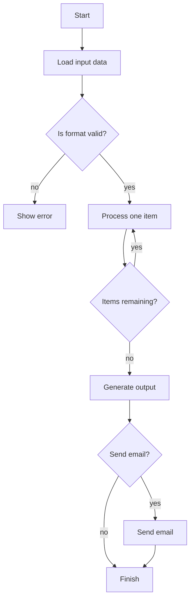

# ExStruct — Excel Structured Extraction Engine

ExStruct reads Excel workbooks and outputs structured data (tables, shapes, charts) as JSON by default, with optional YAML/TOON formats. It targets both COM/Excel environments (rich extraction) and non-COM environments (cells + table candidates), with tunable detection heuristics and multiple output modes to fit LLM/RAG pipelines.

## Features

- **Excel → Structured JSON**: cells, shapes, charts, and table candidates per sheet.
- **Output modes**: `light` (cells + table candidates only), `standard` (texted shapes + arrows, charts), `verbose` (all shapes with width/height).
- **Formats**: JSON (compact by default, `--pretty` available), YAML, TOON (optional dependencies).
- **Table detection tuning**: adjust heuristics at runtime via API.
- **CLI rendering** (Excel required): optional PDF and per-sheet PNGs.
- **Graceful fallback**: if Excel COM is unavailable, extraction falls back to cells + table candidates without crashing.

## Installation

```bash
pip install exstruct
```

Optional extras:

- YAML: `pip install pyyaml`
- TOON: `pip install python-toon`
- Rendering (PDF/PNG): Excel + `pip install pypdfium2`

## Quick Start (CLI)

```bash
exstruct input.xlsx                # compact JSON (default)
exstruct input.xlsx --pretty       # pretty-printed JSON
exstruct input.xlsx --format yaml  # YAML (needs pyyaml)
exstruct input.xlsx --format toon  # TOON (needs python-toon)
exstruct input.xlsx --mode light   # cells + table candidates only
exstruct input.xlsx --pdf --image  # PDF and PNGs (Excel required)
```

## Quick Start (Python)

```python
from pathlib import Path
from exstruct import extract, export, set_table_detection_params

# Tune table detection (optional)
set_table_detection_params(table_score_threshold=0.3, density_min=0.04)

# Extract with modes: "light", "standard", "verbose"
wb = extract("input.xlsx", mode="standard")
export(wb, Path("out.json"), pretty=False)  # compact JSON
```

## Table Detection Tuning

```python
from exstruct import set_table_detection_params

set_table_detection_params(
    table_score_threshold=0.35,  # increase to be stricter
    density_min=0.05,
    coverage_min=0.2,
    min_nonempty_cells=3,
)
```

Use higher thresholds to reduce false positives; lower them if true tables are missed.

## Output Modes

- **light**: cells + table candidates (no COM needed).
- **standard**: texted shapes + arrows, charts (COM if available), table candidates.
- **verbose**: all shapes (with width/height), charts, table candidates.

## Error Handling / Fallbacks

- Excel COM unavailable → falls back to cells + table candidates; shapes/charts empty.
- Shape extraction failure → logs warning, still returns cells + table candidates.
- CLI prints errors to stdout/stderr and returns non-zero on failures.

## Optional Rendering

Requires Excel and `pypdfium2`.

```bash
exstruct input.xlsx --pdf --image --dpi 144
```

Creates `<output>.pdf` and `<output>_images/` PNGs per sheet.

## Benchmark: Excel Structuring Demo

To show how well exstruct can structure Excel, we parse a workbook that combines three elements on one sheet and share an AI reasoning benchmark that uses the JSON output.

- Table (sales data)
- Line chart
- Flowchart built only with shapes

(Screenshot below is the actual sample Excel sheet)


### 1. Input: Excel Sheet Overview

This sample Excel contains:

### ① Table (Sales Data)

| Month  | Product A | Product B | Product C |
| ------ | --------- | --------- | --------- |
| Jan-25 | 120       | 80        | 60        |
| Feb-25 | 135       | 90        | 64        |
| Mar-25 | 150       | 100       | 70        |
| Apr-25 | 170       | 110       | 72        |
| May-25 | 160       | 120       | 75        |
| Jun-25 | 180       | 130       | 80        |

### ② Chart (Line Chart)

- Title: Sales Data
- Series: Product A / Product B / Product C (six months)
- Y axis: 0–200

### ③ Flowchart built with shapes

The sheet includes this flow:

- Start / End
- Format check
- Loop (items remaining?)
- Error handling
- Yes/No decision for sending email

### 2. Output: Structured JSON produced by exstruct (excerpt)

Below is a **shortened JSON output example** from parsing this Excel workbook.

```json
{
  "book_name": "sample.xlsx",
  "sheets": {
    "Sheet1": {
      "rows": [
        {
          "r": 3,
          "c": {
            "1": "月",
            "2": "製品A",
            "3": "製品B",
            "4": "製品C"
          }
        },
        ...
      ],
      "shapes": [
        {
          "text": "開始",
          "l": 148,
          "t": 220,
          "type": "AutoShape-FlowchartProcess"
        },
        {
          "text": "入力データ読み込み",
          "l": 132,
          "t": 282,
          "type": "AutoShape-FlowchartProcess"
        },
        {
          "l": 193,
          "t": 246,
          "type": "AutoShape-Mixed",
          "begin_arrow_style": 1,
          "end_arrow_style": 2,
          "direction": "N"
        },
        ...
      ],
      "charts": [
        {
          "name": "Chart 1",
          "chart_type": "Line",
          "title": "売上データ",
          "y_axis_range": [
            0.0,
            200.0
          ],
          "series": [
            {
              "name": "製品A",
              "name_range": "Sheet1!$C$3",
              "x_range": "Sheet1!$B$4:$B$9",
              "y_range": "Sheet1!$C$4:$C$9"
            },
            ...
          ],
          "l": 377,
          "t": 25
        }
      ],
      "table_candidates": [
        "B3:E9"
      ]
    }
  }
}
```

### 3. How AI (Copilot / LLM) interprets the JSON

````md
Below is the Markdown reconstruction of the Excel workbook. The table, chart, and flowchart are all represented.

---

## 📊 Sales Data Table

| Month      | Product A | Product B | Product C |
| ---------- | --------- | --------- | --------- |
| 2025-01-01 | 120       | 80        | 60        |
| 2025-02-01 | 135       | 90        | 64        |
| 2025-03-01 | 150       | 100       | 70        |
| 2025-04-01 | 170       | 110       | 72        |
| 2025-05-01 | 160       | 120       | 75        |
| 2025-06-01 | 180       | 130       | 80        |

---

## 📈 Sales Data (Line Chart)

- Chart title: **売上データ (Sales Data)**
- Chart type: Line
- Y-axis range: 0 to 200
- Data series:
  - Product A: 120 → 135 → 150 → 170 → 160 → 180
  - Product B: 80 → 90 → 100 → 110 → 120 → 130
  - Product C: 60 → 64 → 70 → 72 → 75 → 80

---

## 🔄 Process Flow (Mermaid Flowchart)


````

From this we can see:

**exstruct's JSON is already in a format that AI can read and reason over directly.**

### 4. Summary

This benchmark confirms exstruct can:

- **Parse tables, charts, and shapes (flowcharts) simultaneously**
- Convert the semantic structure of Excel into JSON
- Let AI/LLMs read that JSON directly and reconstruct the workbook contents

In short, **exstruct = “an engine that converts Excel into a format AI can understand.”**

## Notes

- Default JSON is compact to reduce tokens; use `--pretty` or `pretty=True` when readability matters.
- Field `table_candidates` replaces `tables`; adjust downstream consumers accordingly.

## License

BSD-3-Clause. See `LICENSE` for details.

## Documentation

- API Reference (GitHub Pages): https://harumiweb.github.io/exstruct/
