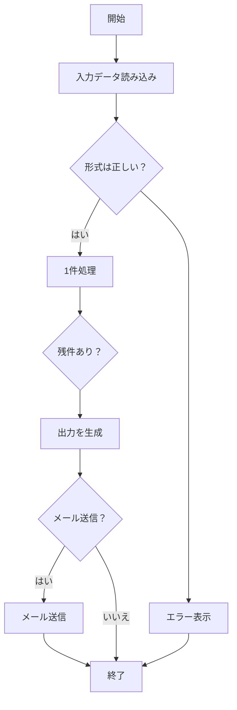

# ExStruct — Excel 構造化抽出エンジン

[](https://pypi.org/project/exstruct/) [](https://pepy.tech/projects/exstruct)  [](https://github.com/harumiWeb/exstruct/actions/workflows/pytest.yml) [](https://app.codacy.com/gh/harumiWeb/exstruct/dashboard?utm_source=gh&utm_medium=referral&utm_content=&utm_campaign=Badge_grade) [](https://codecov.io/gh/harumiWeb/exstruct)


ExStruct は Excel ワークブックを読み取り、構造化データ（セル・テーブル候補・図形・チャート・SmartArt・印刷範囲ビュー）をデフォルトで JSON に出力します。必要に応じて YAML/TOON も選択でき、COM/Excel 環境ではリッチ抽出、非 COM 環境ではセル＋テーブル候補＋印刷範囲へのフォールバックで安全に動作します。LLM/RAG 向けに検出ヒューリスティックや出力モードを調整可能です。

## 主な特徴

- **Excel → 構造化 JSON**: セル、図形、チャート、SmartArt、テーブル候補、セル結合範囲、印刷範囲/自動改ページ範囲（PrintArea/PrintAreaView）をシート単位・範囲単位で出力。
- **出力モード**: `light`（セル＋テーブル候補のみ）、`standard`（テキスト付き図形＋矢印、チャート、SmartArt、セル結合範囲）、`verbose`（全図形を幅高さ付きで出力、セルのハイパーリンクも出力）。
- **フォーマット**: JSON（デフォルトはコンパクト、`--pretty` で整形）、YAML、TOON（任意依存）。
- **テーブル検出のチューニング**: API でヒューリスティックを動的に変更可能。
- **ハイパーリンク抽出**: `verbose` モード（または `include_cell_links=True` 指定）でセルのリンクを `links` に出力。
- **CLI レンダリング**（Excel 必須）: PDF とシート画像を生成可能。
- **安全なフォールバック**: Excel COM 不在でもプロセスは落ちず、セル＋テーブル候補＋印刷範囲に切り替え（図形・チャートは空）。

## インストール

```bash
pip install exstruct
```

オプション依存:

- YAML: `pip install pyyaml`
- TOON: `pip install python-toon`
- レンダリング（PDF/PNG）: Excel + `pip install pypdfium2 pillow`
- まとめて導入: `pip install exstruct[yaml,toon,render]`

プラットフォーム注意:

- 図形・チャートを含むフル抽出は Windows + Excel (xlwings/COM) 前提。その他プラットフォームでは `mode=light` でセル＋`table_candidates` のみ安全に取得できます。

## クイックスタート CLI

```bash
exstruct input.xlsx > output.json          # デフォルトは標準出力のコンパクト JSON
exstruct input.xlsx -o out.json --pretty   # 整形 JSON をファイルへ
exstruct input.xlsx --format yaml          # YAML（pyyaml が必要）
exstruct input.xlsx --format toon          # TOON（python-toon が必要）
exstruct input.xlsx --sheets-dir sheets/   # シートごとに分割出力
exstruct input.xlsx --auto-page-breaks-dir auto_areas/  # COM 限定（利用可能な環境のみ表示）
exstruct input.xlsx --mode light           # セル＋テーブル候補のみ
exstruct input.xlsx --pdf --image          # PDF と PNG（Excel 必須）
```

自動改ページ範囲の書き出しは API/CLI 両方に対応（Excel/COM が必要）し、CLI は利用可能な環境でのみ `--auto-page-breaks-dir` を表示します。

## クイックスタート Python

```python
from pathlib import Path
from exstruct import extract, export, set_table_detection_params

# テーブル検出を調整（任意）
set_table_detection_params(table_score_threshold=0.3, density_min=0.04)

# モード: "light" / "standard" / "verbose"
wb = extract("input.xlsx", mode="standard")  # standard ではリンクはデフォルト非出力
export(wb, Path("out.json"), pretty=False)  # コンパクト JSON

# モデルの便利メソッド: 反復・インデックス・直列化
first_sheet = wb["Sheet1"]           # __getitem__ でシート取得
for name, sheet in wb:               # __iter__ で (name, SheetData) を列挙
    print(name, len(sheet.rows))
wb.save("out.json", pretty=True)     # WorkbookData を拡張子に応じて保存
first_sheet.save("sheet.json")       # SheetData も同様に保存
print(first_sheet.to_yaml())         # YAML 文字列（pyyaml 必須）

# ExStructEngine: インスタンスごとの設定（ネスト構造）
from exstruct import (
    DestinationOptions,
    ExStructEngine,
    FilterOptions,
    FormatOptions,
    OutputOptions,
    StructOptions,
    export_auto_page_breaks,
)

engine = ExStructEngine(
    options=StructOptions(mode="verbose"),  # verbose ではハイパーリンクがデフォルトで含まれる
    output=OutputOptions(
        format=FormatOptions(pretty=True),
        filters=FilterOptions(include_shapes=False),  # 図形を出力から除外
        destinations=DestinationOptions(sheets_dir=Path("out_sheets")),  # シートごとに保存
    ),
)
wb2 = engine.extract("input.xlsx")
engine.export(wb2, Path("out_filtered.json"))  # フィルタ適用後の出力

# standard でハイパーリンクを有効化
engine_links = ExStructEngine(options=StructOptions(mode="standard", include_cell_links=True))
with_links = engine_links.extract("input.xlsx")

# 印刷範囲ごとに書き出す
from exstruct import export_print_areas_as
export_print_areas_as(wb, "areas", fmt="json", pretty=True)  # 印刷範囲がある場合のみファイル生成

# 自動改ページ範囲の抽出/出力（COM 限定。自動改ページが無い場合は例外を送出）
engine_auto = ExStructEngine(
    output=OutputOptions(
        destinations=DestinationOptions(auto_page_breaks_dir=Path("auto_areas"))
    )
)
wb_auto = engine_auto.extract("input.xlsx")  # SheetData.auto_print_areas を含む
engine_auto.export(wb_auto, Path("out_with_auto.json"))  # 自動改ページごとのファイルも auto_areas/* に保存
export_auto_page_breaks(wb_auto, "auto_areas", fmt="json", pretty=True)
```

**備考 (COM 非対応環境):** Excel COM が使えない場合でもセル＋`table_candidates` は返りますが、`shapes` / `charts` は空になります。

## テーブル検出パラメータ

```python
from exstruct import set_table_detection_params

set_table_detection_params(
    table_score_threshold=0.35,  # 厳しくするなら上げる
    density_min=0.05,
    coverage_min=0.2,
    min_nonempty_cells=3,
)
```

値を上げると誤検知が減り、下げると検出漏れが減ります。

## 出力モード

- **light**: セル＋テーブル候補のみ（COM 不要）。
- **standard**: テキスト付き図形＋矢印、チャート（COM ありで取得）、テーブル候補。セルのハイパーリンクは `include_cell_links=True` を指定したときのみ出力。
- **verbose**: all shapes, charts, table_candidates, hyperlinks, and `colors_map`.

## エラーハンドリング / フォールバック

- Excel COM 不在時はセル＋テーブル候補に自動フォールバック（図形・チャートは空）。
- 図形抽出失敗時も警告を出しつつセル＋テーブル候補を返却。
- CLI はエラーを stdout/stderr に出し、失敗時は非ゼロ終了コード。

## 任意レンダリング

Excel と `pypdfium2` が必要です:

```bash
exstruct input.xlsx --pdf --image --dpi 144
```

`<output>.pdf` と `<output>_images/` 配下に PNG を生成します。

## 例 ①: Excel 構造化デモ

本ライブラリ exstruct がどの程度 Excel を構造化できるのかを示すため、
以下の 3 要素を 1 シートにまとめた Excel を解析し、
その JSON 出力を用いた LLM 推論例 を掲載します。

- 表（売上データ）
- 折れ線グラフ
- 図形のみで作成したフローチャート

（下画像が実際のサンプル Excel シート）

サンプル Excel: `sample/sample.xlsx`

### 1. Input: Excel Sheet Overview

このサンプル Excel には以下のデータが含まれています：

### ① 表 (売上データ)

| 月     | 製品 A | 製品 B | 製品 C |
| ------ | ------ | ------ | ------ |
| Jan-25 | 120    | 80     | 60     |
| Feb-25 | 135    | 90     | 64     |
| Mar-25 | 150    | 100    | 70     |
| Apr-25 | 170    | 110    | 72     |
| May-25 | 160    | 120    | 75     |
| Jun-25 | 180    | 130    | 80     |

### ② グラフ (折れ線グラフ)

- タイトル: 売上データ
- 系列: 製品 A / 製品 B / 製品 C（半年分）
- Y 軸: 0–200

### ③ 図形によるフローチャート

シート内に以下を含むフローがあります：

- 開始 / 終了
- 形式チェック
- ループ（残件あり？）
- エラーハンドリング
- メール送信の Yes/No 判定

### 2. Output: exstruct が生成する構造化 JSON（抜粋）

以下は、実際にこの Excel ブックを解析した際の**短縮版 JSON 出力例** です。

```json
{
  "book_name": "sample.xlsx",
  "sheets": {
    "Sheet1": {
      "rows": [
        {
          "r": 3,
          "c": {
            "1": "月",
            "2": "製品A",
            "3": "製品B",
            "4": "製品C"
          }
        },
        ...
      ],
      "shapes": [
        {
          "id": 1,
          "text": "開始",
          "l": 148,
          "t": 220,
          "kind": "shape",
          "type": "AutoShape-FlowchartProcess"
        },
        {
          "id": 2,
          "text": "入力データ読み込み",
          "l": 132,
          "t": 282,
          "kind": "shape",
          "type": "AutoShape-FlowchartProcess"
        },
        {
          "l": 193,
          "t": 246,
          "kind": "arrow",
          "begin_arrow_style": 1,
          "end_arrow_style": 2,
          "begin_id": 1,
          "end_id": 2,
          "direction": "N"
        },
        ...
      ],
      "charts": [
        {
          "name": "Chart 1",
          "chart_type": "Line",
          "title": "売上データ",
          "y_axis_range": [
            0.0,
            200.0
          ],
          "series": [
            {
              "name": "製品A",
              "name_range": "Sheet1!$C$3",
              "x_range": "Sheet1!$B$4:$B$9",
              "y_range": "Sheet1!$C$4:$C$9"
            },
            ...
          ],
          "l": 377,
          "t": 25
        }
      ],
      "table_candidates": [
        "B3:E9"
      ]
    }
  }
}
```

### 3. AI (Copilot / LLM) に JSON を渡した際の理解結果

````md
以下は、提供された Excel ブックの内容を Markdown 形式で再構成したものです。表、グラフ、フローチャートの 3 要素をそれぞれ適切に表現しています。

---

## 📊 売上データ表

| 月         | 製品 A | 製品 B | 製品 C |
| ---------- | ------ | ------ | ------ |
| 2025-01-01 | 120    | 80     | 60     |
| 2025-02-01 | 135    | 90     | 64     |
| 2025-03-01 | 150    | 100    | 70     |
| 2025-04-01 | 170    | 110    | 72     |
| 2025-05-01 | 160    | 120    | 75     |
| 2025-06-01 | 180    | 130    | 80     |

---

## 📈 売上データ（折れ線グラフ）

- グラフタイトル: **売上データ**
- グラフ種類: 折れ線グラフ（Line）
- Y 軸範囲: 0 ～ 200
- データ系列:
  - 製品 A: 120 → 135 → 150 → 170 → 160 → 180
  - 製品 B: 80 → 90 → 100 → 110 → 120 → 130
  - 製品 C: 60 → 64 → 70 → 72 → 75 → 80

---

## 🔄 処理フロー（Mermaid フローチャート）


````

## 例 ②: 一般的な申請書

### Excel データ


### ExStruct JSON

※長いので一部省略

```json
{
  "book_name": "ja_form.xlsx",
  "sheets": {
    "Sheet1": {
      "rows": [
        { "r": 1, "c": { "0": "介護保険負担限度額認定申請書" } },
        {
          "r": 3,
          "c": { "0": "（申請先）", "7": "  　　　　年　　　　月　　　　日" }
        },
        { "r": 4, "c": { "1": "X市長　" } },
        ...
      ],
      "table_candidates": ["B25:C26", "C37:D50"],
      "merged_cells": {
        "schema": ["r1", "c1", "r2", "c2", "v"],
        "items": [
          [55, 5, 55, 10, "申請者が被保険者本人の場合には、下記について記載は不要です。"],
          [54, 8, 54, 10, " "],
          [51, 5, 52, 6, "有価証券"],
          ...
        ]
      }
    }
  }
}

```

### 互換性メモ（v0.3.5）: merged_cells 形式変更

`merged_cells` は v0.3.5 で「オブジェクト配列」から「schema/items」形式に変更されました（JSON 利用側には破壊的変更）。

旧形式（<= v0.3.2）:

```json
"merged_cells": [
  { "r1": 55, "c1": 5, "r2": 55, "c2": 10, "v": "申請者が被保険者本人の場合には、下記について記載は不要です。" },
  { "r1": 51, "c1": 5, "r2": 52, "c2": 6, "v": "有価証券" }
]
```

新形式（v0.3.5+）:

```json
"merged_cells": {
  "schema": ["r1", "c1", "r2", "c2", "v"],
  "items": [
    [55, 5, 55, 10, "申請者が被保険者本人の場合には、下記について記載は不要です。"],
    [51, 5, 52, 6, "有価証券"]
  ]
}
```

移行例（併存パース）:

```python
def normalize_merged_cells(raw):
    schema = ["r1", "c1", "r2", "c2", "v"]
    if isinstance(raw, list):
        items = [[d.get(k, " ") for k in schema] for d in raw]
        return {"schema": schema, "items": items}
    if isinstance(raw, dict) and "schema" in raw and "items" in raw:
        return raw
    return None
```

### LLM 推論による ExStruct JSON → Markdown 変換結果

```md
# 介護保険負担限度額認定申請書

（申請先）　　　　　　　　　　　　　　年　　月　　日  
X 市長

次のとおり関係書類を添えて、食費・居住費（滞在費）に係る負担限度額認定を申請します。

---

## 被保険者情報

| 項目         | 内容                         |
| ------------ | ---------------------------- |
| フリガナ     |                              |
| 被保険者氏名 |                              |
| 被保険者番号 |                              |
| 個人番号     |                              |
| 生年月日     | 明・大・昭　　年　　月　　日 |
| 住所         |                              |
| 連絡先       |                              |

---

## 入所（院）した介護保険施設

| 項目                  | 内容       |
| --------------------- | ---------- |
| 施設所在地・名称（※） |            |
| 連絡先                |            |
| 入所（院）年月日      | 年　月　日 |

**（※）介護保険施設に入所（院）していない場合、およびショートステイ利用時は記入不要**

---

## 配偶者の有無

| 項目         | 内容     |
| ------------ | -------- |
| 配偶者の有無 | 有 ・ 無 |

※「無」の場合、以下の「配偶者に関する事項」は記入不要

---

## 配偶者に関する事項

| 項目                                           | 内容                       |
| ---------------------------------------------- | -------------------------- |
| フリガナ                                       |                            |
| 氏名                                           |                            |
| 生年月日                                       | 明・大・昭　年　月　日     |
| 個人番号                                       |                            |
| 住所                                           | 〒                         |
| 連絡先                                         |                            |
| 本年 1 月 1 日現在の住所（現住所と異なる場合） | 〒                         |
| 課税状況                                       | 市町村民税：課税 ・ 非課税 |

---

## 収入等に関する申告

以下の該当する項目にチェックしてください。

- □ ① 生活保護受給者
- □ ② 市町村民税世帯非課税である老齢福祉年金受給者
- □ ③ 市町村民税世帯非課税者で、課税年金収入額＋遺族年金・障害年金＋その他所得の合計が **年額 80 万円以下**
- □ ④ 同上で **80 万円超〜120 万円以下**
- □ ⑤ 同上で **120 万円超**

※遺族年金には寡婦年金、寡夫年金、母子年金、準母子年金、遺児年金を含む

---

## 預貯金等に関する申告

- □ 預貯金・有価証券等の合計額が以下の基準以下である
  - ② の方：1000 万円（夫婦 2000 万円）
  - ③ の方：650 万円（夫婦 1650 万円）
  - ④ の方：550 万円（夫婦 1550 万円）
  - ⑤ の方：500 万円（夫婦 1500 万円）
  - ※第 2 号被保険者（40〜64 歳）は ③〜⑤ の方：1000 万円（夫婦 2000 万円）以下

### 預貯金等の内訳

| 項目                       | 金額             |
| -------------------------- | ---------------- |
| 預貯金額                   | 円               |
| 有価証券（評価概算額）     | 円               |
| その他（現金・負債を含む） | 円（内容を記入） |

---

## 申請者情報（※被保険者本人の場合は不要）

| 項目                   | 内容 |
| ---------------------- | ---- |
| 申請者氏名             |      |
| 連絡先（自宅・勤務先） |      |
| 申請者住所             |      |
| 本人との関係           |      |

---

## 注意事項

1. この申請書における「配偶者」には、世帯分離している配偶者および内縁関係の者を含む。
2. 預貯金等は、同じ種類を複数所有している場合すべて記入し、通帳等の写しを添付すること。
3. 書き切れない場合は余白または別紙に記入して添付すること。
4. 虚偽の申告により不正に特定入所者介護サービス費等の支給を受けた場合、介護保険法第 22 条第 1 項に基づき、支給額および最大 2 倍の加算金を返還する必要がある。
```

## 考察

上記の実験結果から、

**ExStruct の JSON は AI にとって "そのまま意味として理解できる形式" である**

ということが明確に示されています。

その他の本ライブラリを使った LLM 推論サンプルは以下のディレクトリにあります。

- [Basic Excel](sample/basic/)
- [Flowchart](sample/flowchart/)
- [Gantt Chart](sample/gantt_chart/)
- [Application forms with many merged cells](sample/forms_with_many_merged_cells/)

### 4. Summary

このベンチマークにより、本ライブラリが次の能力を持つことが確認できます：

- **表・グラフ・図形（フローチャート）の同時解析**
- Excel の意味的構造を JSON に変換
- AI（LLM）がその JSON を直接読み取り、Excel 内容を再構築できる

つまり **exstruct = “Excel を AI が理解できるフォーマットに変換するエンジン”** です。

## 備考

- デフォルト JSON はコンパクト（トークン削減目的）。可読性が必要なら `--pretty` / `pretty=True` を利用してください。
- フィールド名は `table_candidates` を使用します（以前の `tables` から変更）。下流のスキーマを調整してください。

## 企業向け

ExStruct は主に **ライブラリ** として利用される想定で、サービスではありません。

- 公式サポートや SLA は提供されません
- 迅速な機能追加より、長期的な安定性を優先します
- 企業利用ではフォークや内部改修が前提です

次のようなチームに適しています。

- ブラックボックス化されたツールではなく、透明性が必要
- 必要に応じて内部フォークを保守できる

## 印刷範囲と自動改ページ範囲（PrintArea / PrintAreaView）

- `SheetData.print_areas` に印刷範囲（セル座標）が含まれます（light/standard/verbose で取得）。
- `SheetData.auto_print_areas` に Excel COM が計算した自動改ページ範囲が入ります（自動改ページ抽出を有効化した場合のみ、COM 限定）。
- `export_print_areas_as(...)` や CLI `--print-areas-dir` で印刷範囲ごとにファイルを出力できます（印刷範囲が無い場合はファイルを作りません）。
- CLI `--auto-page-breaks-dir`（COM 限定）、`DestinationOptions.auto_page_breaks_dir`（推奨）、または `export_auto_page_breaks(...)` で自動改ページ範囲ごとにファイルを出力できます。自動改ページが存在しない場合、`export_auto_page_breaks(...)` は `ValueError` を送出します。
- `PrintAreaView` には範囲内の行・テーブル候補に加え、範囲と交差する図形/チャートを含みます（サイズ不明の図形は座標のみで判定）。`normalize=True` で行/列を範囲起点に再基準化できます。

## アーキテクチャ

ExStruct はパイプライン型のアーキテクチャを採用し、
抽出戦略（Backend）とオーケストレーション（Pipeline）、
そして意味モデルの構築を分離しています。

→ 参照: [docs/architecture/pipeline.md](docs/architecture/pipeline.md)

## コントリビュート

ExStruct の内部実装を拡張する場合は、
コントリビューター向けのアーキテクチャガイドを確認してください。

→ [docs/contributors/architecture.md](docs/contributors/architecture.md)

## カバレッジに関する注意

セル構造推論ロジック（cells.py）は、ヒューリスティックルールと
Excel 固有の動作に依存しています。網羅的なテストは現実世界の信頼性を反映できないため、完全なカバレッジは意図的に追求されていません。

## License

BSD-3-Clause. See `LICENSE` for details.

## ドキュメント

- API リファレンス (GitHub Pages): https://harumiweb.github.io/exstruct/
- JSON Schema は `schemas/` にモデルごとに配置しています。モデル変更後は `python scripts/gen_json_schema.py` で再生成してください。
