# ExStruct — Excel 構造化抽出エンジン

[](https://pypi.org/project/exstruct/) [](https://pepy.tech/projects/exstruct)  [](https://github.com/harumiWeb/exstruct/actions/workflows/pytest.yml) [](https://app.codacy.com/gh/harumiWeb/exstruct/dashboard?utm_source=gh&utm_medium=referral&utm_content=&utm_campaign=Badge_grade)


ExStruct は Excel ワークブックを読み取り、構造化データ（セル・テーブル候補・図形・チャート・印刷範囲ビュー）をデフォルトで JSON に出力します。必要に応じて YAML/TOON も選択でき、COM/Excel 環境ではリッチ抽出、非 COM 環境ではセル＋テーブル候補＋印刷範囲へのフォールバックで安全に動作します。LLM/RAG 向けに検出ヒューリスティックや出力モードを調整可能です。

## 主な特徴

- **Excel → 構造化 JSON**: セル、図形、チャート、テーブル候補、印刷範囲/自動改ページ範囲（PrintArea/PrintAreaView）をシート単位・範囲単位で出力。
- **出力モード**: `light`（セル＋テーブル候補のみ）、`standard`（テキスト付き図形＋矢印、チャート）、`verbose`（全図形を幅高さ付きで出力、セルのハイパーリンクも出力）。
- **フォーマット**: JSON（デフォルトはコンパクト、`--pretty` で整形）、YAML、TOON（任意依存）。
- **テーブル検出のチューニング**: API でヒューリスティックを動的に変更可能。
- **ハイパーリンク抽出**: `verbose` モード（または `include_cell_links=True` 指定）でセルのリンクを `links` に出力。
- **CLI レンダリング**（Excel 必須）: PDF とシート画像を生成可能。
- **安全なフォールバック**: Excel COM 不在でもプロセスは落ちず、セル＋テーブル候補＋印刷範囲に切り替え（図形・チャートは空）。

## インストール

```bash
pip install exstruct
```

オプション依存:

- YAML: `pip install pyyaml`
- TOON: `pip install python-toon`
- レンダリング（PDF/PNG）: Excel + `pip install pypdfium2 pillow`
- まとめて導入: `pip install exstruct[yaml,toon,render]`

プラットフォーム注意:

- 図形・チャートを含むフル抽出は Windows + Excel (xlwings/COM) 前提。その他プラットフォームでは `mode=light` でセル＋`table_candidates` のみ安全に取得できます。

## クイックスタート CLI

```bash
exstruct input.xlsx > output.json          # デフォルトは標準出力のコンパクト JSON
exstruct input.xlsx -o out.json --pretty   # 整形 JSON をファイルへ
exstruct input.xlsx --format yaml          # YAML（pyyaml が必要）
exstruct input.xlsx --format toon          # TOON（python-toon が必要）
exstruct input.xlsx --sheets-dir sheets/   # シートごとに分割出力
exstruct input.xlsx --auto-page-breaks-dir auto_areas/  # COM 限定（利用可能な環境のみ表示）
exstruct input.xlsx --mode light           # セル＋テーブル候補のみ
exstruct input.xlsx --pdf --image          # PDF と PNG（Excel 必須）
```

自動改ページ範囲の書き出しは API/CLI 両方に対応（Excel/COM が必要）し、CLI は利用可能な環境でのみ `--auto-page-breaks-dir` を表示します。

## クイックスタート Python

```python
from pathlib import Path
from exstruct import extract, export, set_table_detection_params

# テーブル検出を調整（任意）
set_table_detection_params(table_score_threshold=0.3, density_min=0.04)

# モード: "light" / "standard" / "verbose"
wb = extract("input.xlsx", mode="standard")  # standard ではリンクはデフォルト非出力
export(wb, Path("out.json"), pretty=False)  # コンパクト JSON

# モデルの便利メソッド: 反復・インデックス・直列化
first_sheet = wb["Sheet1"]           # __getitem__ でシート取得
for name, sheet in wb:               # __iter__ で (name, SheetData) を列挙
    print(name, len(sheet.rows))
wb.save("out.json", pretty=True)     # WorkbookData を拡張子に応じて保存
first_sheet.save("sheet.json")       # SheetData も同様に保存
print(first_sheet.to_yaml())         # YAML 文字列（pyyaml 必須）

# ExStructEngine: インスタンスごとの設定（ネスト構造）
from exstruct import (
    DestinationOptions,
    ExStructEngine,
    FilterOptions,
    FormatOptions,
    OutputOptions,
    StructOptions,
    export_auto_page_breaks,
)

engine = ExStructEngine(
    options=StructOptions(mode="verbose"),  # verbose ではハイパーリンクがデフォルトで含まれる
    output=OutputOptions(
        format=FormatOptions(pretty=True),
        filters=FilterOptions(include_shapes=False),  # 図形を出力から除外
        destinations=DestinationOptions(sheets_dir=Path("out_sheets")),  # シートごとに保存
    ),
)
wb2 = engine.extract("input.xlsx")
engine.export(wb2, Path("out_filtered.json"))  # フィルタ適用後の出力

# standard でハイパーリンクを有効化
engine_links = ExStructEngine(options=StructOptions(mode="standard", include_cell_links=True))
with_links = engine_links.extract("input.xlsx")

# 印刷範囲ごとに書き出す
from exstruct import export_print_areas_as
export_print_areas_as(wb, "areas", fmt="json", pretty=True)  # 印刷範囲がある場合のみファイル生成

# 自動改ページ範囲の抽出/出力（COM 限定。自動改ページが無い場合は例外を送出）
engine_auto = ExStructEngine(
    output=OutputOptions(
        destinations=DestinationOptions(auto_page_breaks_dir=Path("auto_areas"))
    )
)
wb_auto = engine_auto.extract("input.xlsx")  # SheetData.auto_print_areas を含む
engine_auto.export(wb_auto, Path("out_with_auto.json"))  # 自動改ページごとのファイルも auto_areas/* に保存
export_auto_page_breaks(wb_auto, "auto_areas", fmt="json", pretty=True)
```

**備考 (COM 非対応環境):** Excel COM が使えない場合でもセル＋`table_candidates` は返りますが、`shapes` / `charts` は空になります。

## テーブル検出パラメータ

```python
from exstruct import set_table_detection_params

set_table_detection_params(
    table_score_threshold=0.35,  # 厳しくするなら上げる
    density_min=0.05,
    coverage_min=0.2,
    min_nonempty_cells=3,
)
```

値を上げると誤検知が減り、下げると検出漏れが減ります。

## 出力モード

- **light**: セル＋テーブル候補のみ（COM 不要）。
- **standard**: テキスト付き図形＋矢印、チャート（COM ありで取得）、テーブル候補。セルのハイパーリンクは `include_cell_links=True` を指定したときのみ出力。
- **verbose**: all shapes, charts, table_candidates, hyperlinks, and `colors_map`.

## エラーハンドリング / フォールバック

- Excel COM 不在時はセル＋テーブル候補に自動フォールバック（図形・チャートは空）。
- 図形抽出失敗時も警告を出しつつセル＋テーブル候補を返却。
- CLI はエラーを stdout/stderr に出し、失敗時は非ゼロ終了コード。

## 任意レンダリング

Excel と `pypdfium2` が必要です:

```bash
exstruct input.xlsx --pdf --image --dpi 144
```

`<output>.pdf` と `<output>_images/` 配下に PNG を生成します。

## ベンチマーク: Excel 構造化デモ

本ライブラリ exstruct がどの程度 Excel を構造化できるのかを示すため、
以下の 3 要素を 1 シートにまとめた Excel を解析し、
その JSON 出力を用いた AI 推論精度ベンチマーク を掲載します。

- 表（売上データ）
- 折れ線グラフ
- 図形のみで作成したフローチャート

（下画像が実際のサンプル Excel シート）

サンプル Excel: `sample/sample.xlsx`

### 1. Input: Excel Sheet Overview

このサンプル Excel には以下のデータが含まれています：

### ① 表 (売上データ)

| 月     | 製品 A | 製品 B | 製品 C |
| ------ | ------ | ------ | ------ |
| Jan-25 | 120    | 80     | 60     |
| Feb-25 | 135    | 90     | 64     |
| Mar-25 | 150    | 100    | 70     |
| Apr-25 | 170    | 110    | 72     |
| May-25 | 160    | 120    | 75     |
| Jun-25 | 180    | 130    | 80     |

### ② グラフ (折れ線グラフ)

- タイトル: 売上データ
- 系列: 製品 A / 製品 B / 製品 C（半年分）
- Y 軸: 0–200

### ③ 図形によるフローチャート

シート内に以下を含むフローがあります：

- 開始 / 終了
- 形式チェック
- ループ（残件あり？）
- エラーハンドリング
- メール送信の Yes/No 判定

### 2. Output: exstruct が生成する構造化 JSON（抜粋）

以下は、実際にこの Excel ブックを解析した際の**短縮版 JSON 出力例** です。

```json
{
  "book_name": "sample.xlsx",
  "sheets": {
    "Sheet1": {
      "rows": [
        {
          "r": 3,
          "c": {
            "1": "月",
            "2": "製品A",
            "3": "製品B",
            "4": "製品C"
          }
        },
        ...
      ],
      "shapes": [
        {
          "id": 1,
          "text": "開始",
          "l": 148,
          "t": 220,
          "type": "AutoShape-FlowchartProcess"
        },
        {
          "id": 2,
          "text": "入力データ読み込み",
          "l": 132,
          "t": 282,
          "type": "AutoShape-FlowchartProcess"
        },
        {
          "l": 193,
          "t": 246,
          "type": "AutoShape-Mixed",
          "begin_arrow_style": 1,
          "end_arrow_style": 2,
          "begin_id": 1,
          "end_id": 2,
          "direction": "N"
        },
        ...
      ],
      "charts": [
        {
          "name": "Chart 1",
          "chart_type": "Line",
          "title": "売上データ",
          "y_axis_range": [
            0.0,
            200.0
          ],
          "series": [
            {
              "name": "製品A",
              "name_range": "Sheet1!$C$3",
              "x_range": "Sheet1!$B$4:$B$9",
              "y_range": "Sheet1!$C$4:$C$9"
            },
            ...
          ],
          "l": 377,
          "t": 25
        }
      ],
      "table_candidates": [
        "B3:E9"
      ]
    }
  }
}
```

### 3. AI (Copilot / LLM) に JSON を渡した際の理解結果

````md
以下は、提供された Excel ブックの内容を Markdown 形式で再構成したものです。表、グラフ、フローチャートの 3 要素をそれぞれ適切に表現しています。

---

## 📊 売上データ表

| 月         | 製品 A | 製品 B | 製品 C |
| ---------- | ------ | ------ | ------ |
| 2025-01-01 | 120    | 80     | 60     |
| 2025-02-01 | 135    | 90     | 64     |
| 2025-03-01 | 150    | 100    | 70     |
| 2025-04-01 | 170    | 110    | 72     |
| 2025-05-01 | 160    | 120    | 75     |
| 2025-06-01 | 180    | 130    | 80     |

---

## 📈 売上データ（折れ線グラフ）

- グラフタイトル: **売上データ**
- グラフ種類: 折れ線グラフ（Line）
- Y 軸範囲: 0 ～ 200
- データ系列:
  - 製品 A: 120 → 135 → 150 → 170 → 160 → 180
  - 製品 B: 80 → 90 → 100 → 110 → 120 → 130
  - 製品 C: 60 → 64 → 70 → 72 → 75 → 80

---

## 🔄 処理フロー（Mermaid フローチャート）

```mermaid
flowchart TD
    A[開始]
    B[入力データ読み込み]
    C{形式は正しい？}
    D[1件処理]
    E{残件あり？}
    F[出力を生成]
    G{メール送信？}
    H[エラー表示]
    I[メール送信]
    J[終了]

    A --> B
    B --> C
    C -->|はい| D
    C --> H
    D --> E
    E --> F
    F --> G
    G -->|はい| I
    G -->|いいえ| J
    H --> J
    I --> J
```


````

このことから、

**exstruct の JSON は AI にとって "そのまま意味として理解できる形式" である**

ということが明確に示されています。

その他の本ライブラリを使ったLLM推論サンプルは以下のディレクトリにあります。

- [Basic Excel](sample/basic/)
- [Flowchart](sample/flowchart/)
- [Gantt Chart](sample/gantt_chart/)

### 4. Summary

このベンチマークにより、本ライブラリが次の能力を持つことが確認できます：

- **表・グラフ・図形（フローチャート）の同時解析**
- Excel の意味的構造を JSON に変換
- AI（LLM）がその JSON を直接読み取り、Excel 内容を再構築できる

つまり **exstruct = “Excel を AI が理解できるフォーマットに変換するエンジン”** です。

## 備考

- デフォルト JSON はコンパクト（トークン削減目的）。可読性が必要なら `--pretty` / `pretty=True` を利用してください。
- フィールド名は `table_candidates` を使用します（以前の `tables` から変更）。下流のスキーマを調整してください。

## 企業向け

ExStruct は主に **ライブラリ** として利用される想定で、サービスではありません。

- 公式サポートや SLA は提供されません
- 迅速な機能追加より、長期的な安定性を優先します
- 企業利用ではフォークや内部改修が前提です

次のようなチームに適しています。
- ブラックボックス化されたツールではなく、透明性が必要
- 必要に応じて内部フォークを保守できる

## 印刷範囲と自動改ページ範囲（PrintArea / PrintAreaView）

- `SheetData.print_areas` に印刷範囲（セル座標）が含まれます（light/standard/verbose で取得）。
- `SheetData.auto_print_areas` に Excel COM が計算した自動改ページ範囲が入ります（自動改ページ抽出を有効化した場合のみ、COM 限定）。
- `export_print_areas_as(...)` や CLI `--print-areas-dir` で印刷範囲ごとにファイルを出力できます（印刷範囲が無い場合はファイルを作りません）。
- CLI `--auto-page-breaks-dir`（COM 限定）、`DestinationOptions.auto_page_breaks_dir`（推奨）、または `export_auto_page_breaks(...)` で自動改ページ範囲ごとにファイルを出力できます。自動改ページが存在しない場合、`export_auto_page_breaks(...)` は `ValueError` を送出します。
- `PrintAreaView` には範囲内の行・テーブル候補に加え、範囲と交差する図形/チャートを含みます（サイズ不明の図形は座標のみで判定）。`normalize=True` で行/列を範囲起点に再基準化できます。

## ドキュメントビルド

- サイトビルド前にモデル断片を再生成してください: `python scripts/gen_model_docs.py`
- mkdocs + mkdocstrings でローカルビルド（開発用依存が必要）: `uv run mkdocs serve` または `uv run mkdocs build`

## License

BSD-3-Clause. See `LICENSE` for details.

## ドキュメント

- API リファレンス (GitHub Pages): https://harumiweb.github.io/exstruct/
- JSON Schema は `schemas/` にモデルごとに配置しています。モデル変更後は `python scripts/gen_json_schema.py` で再生成してください。
