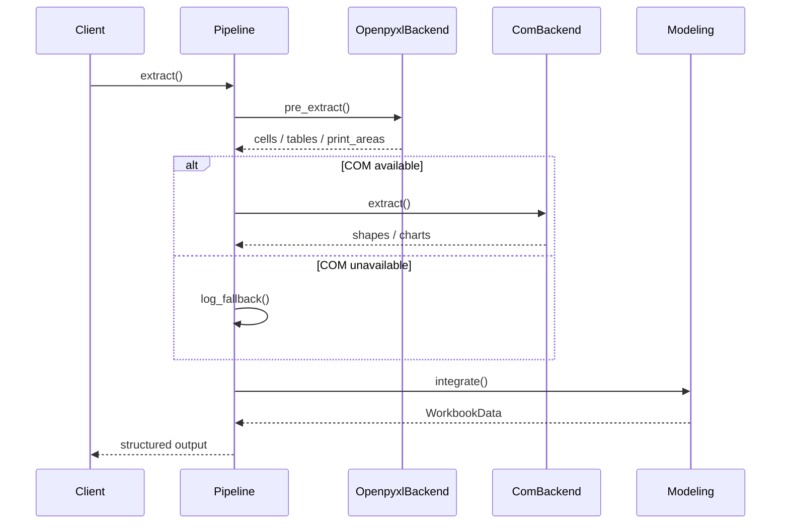

# Pipeline Architecture Overview

ExStruct converts Excel workbooks into **semantic structured JSON** using a
three-layer design: **Pipeline + Backend + Modeling**.

This design enables:

- Separation of Excel COM-dependent and non-dependent logic
- Future expansion to OpenXML/XML direct parsing
- Stable, reliable output for RAG/LLM use cases

---

## End-to-End Flow (High Level)

Processing proceeds in this order:

1. **Pipeline** builds the execution plan
2. **Openpyxl Backend** performs pre-analysis (cells, tables, print areas)
3. **COM Backend** extracts rich data when available (shapes, charts)
4. **Modeling** integrates results into WorkbookData / SheetData
5. Output is generated in the requested format (JSON / YAML / TOON)

---

## Pipeline Responsibilities

The Pipeline is the **control tower**:

- Determines extraction order
- Selects backends
- Controls fallback paths
- Manages intermediate artifacts

The Pipeline is designed to **never read Excel contents directly**.

---

## Backend Responsibilities (Swap Points)

Backends define **how Excel is read**:

| Backend         | Responsibilities                          |
| --------------- | ----------------------------------------- |
| OpenpyxlBackend | Cells / tables / print areas / colors map |
| ComBackend      | Shapes / arrows / charts / SmartArt (TBD) |

This abstraction enables:

- XML direct parsing backend
- LibreOffice backend
- Remote Excel service backend

With **no Pipeline changes required**.

---

## Fallback Design

When COM is unavailable:

- Do not crash on exceptions
- Reuse Openpyxl results as much as possible
- Log the fallback reason explicitly

This is a deliberate design for **batch processing, CI, and automation**.

---

## Modeling Layer Responsibilities

Modeling:

- Integrates results from multiple backends
- Produces normalized WorkbookData / SheetData
- Remains output-format agnostic

The **semantic structure model** for RAG/LLM use is centralized here.

---

## Why This Design?

- Excel has separate worlds: cells, shapes, charts
- COM is powerful but fragile
- LLMs require stable, structured data

Therefore, **pipeline separation** is the most practical approach.
