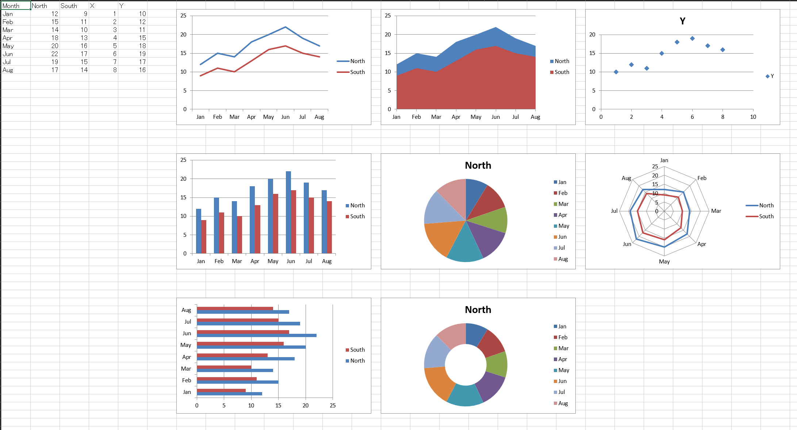

# v0.5.1 Release Notes

This patch release tightens MCP patch operation constraints and updates
documentation for backend behavior clarity.

## Highlights

- Added a service-level guard for backend-only op mixing:
  - `create_chart` and `apply_table_style` can no longer be combined in a
    single request.
- Updated MCP docs and README pages for `create_chart` constraints:
  - COM-only behavior
  - supported chart types: `line`, `column`, `bar`, `area`, `pie`,
    `doughnut`, `scatter`, `radar`
  - chart type aliases: `column_clustered` -> `column`, `bar_clustered` ->
    `bar`, `xy_scatter` -> `scatter`, `donut` -> `doughnut`
  - related flag limitations
  - incompatibility with `apply_table_style` in one request

## Notes

- This is a compatibility and correctness-focused patch release with no new
  public tool surface added.
