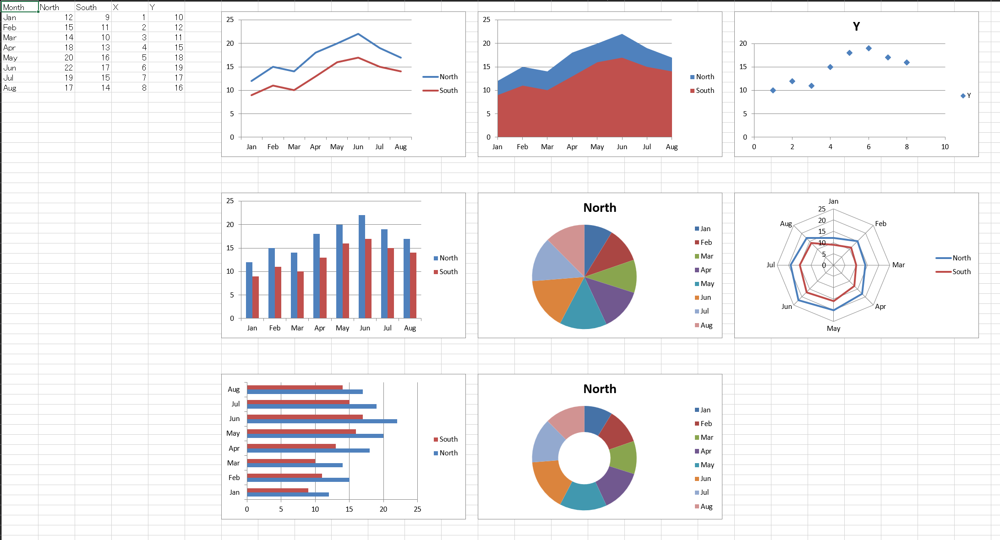

# v0.5.3 Release Notes

This patch release improves `capture_sheet_images` subprocess reliability and
observability, and updates MCP guidance for safe production rollout.

## Highlights

- Added dedicated subprocess worker entrypoint:
  - `python -m exstruct.render.subprocess_worker` is now used for
    `capture_sheet_images` subprocess mode.
  - worker bootstrap is decoupled from parent `__main__` restoration.
- Updated default runtime behavior:
  - MCP now defaults `EXSTRUCT_RENDER_SUBPROCESS=1` based on profile-comparison
    runs showing stable behavior in both modes.
  - `EXSTRUCT_RENDER_SUBPROCESS=0` remains available to force in-process mode.
- Improved timeout and failure diagnostics:
  - wait ordering now prioritizes result receipt before join wait to reduce
    false timeout failures after successful worker output.
  - stage-aware error reporting (`startup` / `join` / `result` / `worker`) now
    includes actionable context and stderr snippets when available.
- Documentation updates:
  - MCP `exstruct_capture_sheet_images` is marked Experimental.
  - README/MCP docs now include subprocess timeout tuning guidance, including
    `EXSTRUCT_RENDER_SUBPROCESS_STARTUP_TIMEOUT_SEC`.

## Notes

- No new patch operations were added in this release.
- MCP tools include the experimental `exstruct_capture_sheet_images` path updated in this release.
- This is a reliability-focused patch release for image-capture execution paths.
