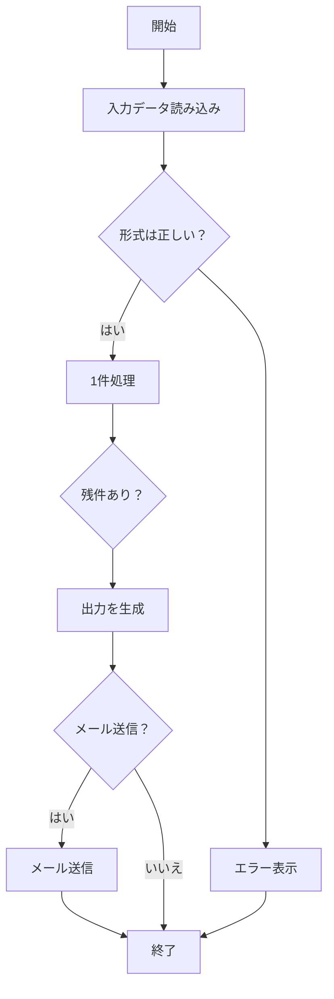

以下は、提供された Excel ブックの内容を Markdown 形式で再構成したものです。表、グラフ、フローチャートの 3 要素をそれぞれ適切に表現しています。

---

## 📊 売上データ表

| 月         | 製品 A | 製品 B | 製品 C |
| ---------- | ------ | ------ | ------ |
| 2025-01-01 | 120    | 80     | 60     |
| 2025-02-01 | 135    | 90     | 64     |
| 2025-03-01 | 150    | 100    | 70     |
| 2025-04-01 | 170    | 110    | 72     |
| 2025-05-01 | 160    | 120    | 75     |
| 2025-06-01 | 180    | 130    | 80     |

---

## 📈 売上データ（折れ線グラフ）

- グラフタイトル: **売上データ**
- グラフ種類: 折れ線グラフ（Line）
- Y 軸範囲: 0 ～ 200
- データ系列:
  - 製品 A: 120 → 135 → 150 → 170 → 160 → 180
  - 製品 B: 80 → 90 → 100 → 110 → 120 → 130
  - 製品 C: 60 → 64 → 70 → 72 → 75 → 80

---

## 🔄 処理フロー（Mermaid フローチャート）

