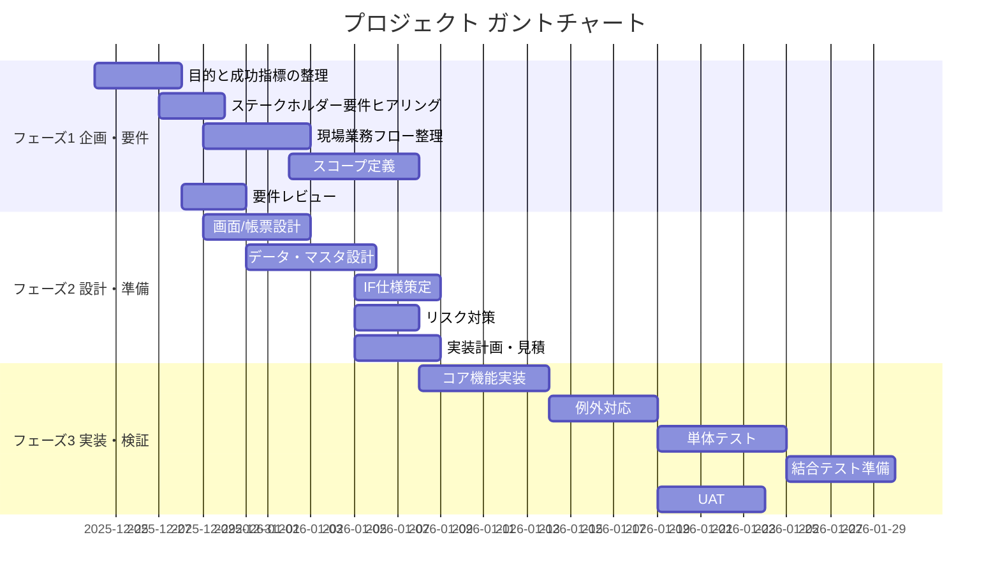

# プロジェクトスケジュール

## 基本情報

| 項目                 | 内容                                                                                                   |
| -------------------- | ------------------------------------------------------------------------------------------------------ |
| プロジェクトタイトル | （未入力）                                                                                             |
| 会社名               | （未入力）                                                                                             |
| プロジェクト主任     | （未入力）                                                                                             |
| プロジェクト開始日   | 2025-12-24                                                                                             |
| テンプレート         | [シンプル ガント チャート (Vertex42)](https://www.vertex42.com/ExcelTemplates/simple-gantt-chart.html) |

---

## スケジュール概要

- 表示期間：**2025-12-22 〜 2026-02-15**
- 週単位で 8 週間表示
- 各タスクは開始日・終了日に基づき自動でガント表示
- 進捗率はセル内バーおよび網掛けで表現

---

## フェーズ別タスク一覧

---

### フェーズ 1：企画・要件

| タスク                         | 担当 | 進捗 | 開始       | 終了       | 日数 |
| ------------------------------ | ---- | ---: | ---------- | ---------- | ---: |
| 目的と成功指標の整理           | 名前 |  50% | 2025-12-24 | 2025-12-27 |    4 |
| ステークホルダー要件ヒアリング |      |  60% | 2025-12-27 | 2025-12-29 |    3 |
| 現場業務フロー整理             |      |  50% | 2025-12-29 | 2026-01-02 |    5 |
| スコープ定義と除外事項確定     |      |  25% | 2026-01-02 | 2026-01-07 |    6 |
| 要件レビューと合意形成         |      |      | 2025-12-28 | 2025-12-30 |    3 |

---

### フェーズ 2：設計・準備

| タスク                 | 進捗 | 開始       | 終了       | 日数 |
| ---------------------- | ---: | ---------- | ---------- | ---: |
| 画面/帳票の基本設計    |  50% | 2025-12-29 | 2026-01-02 |    5 |
| データ項目・マスタ設計 |  50% | 2025-12-31 | 2026-01-05 |    6 |
| インタフェース仕様策定 |      | 2026-01-05 | 2026-01-08 |    4 |
| リスク洗い出しと対策案 |      | 2026-01-05 | 2026-01-07 |    3 |
| 実装計画・見積確定     |      | 2026-01-05 | 2026-01-08 |    4 |

---

### フェーズ 3：実装・検証

| タスク                 | 開始       | 終了       | 日数 |
| ---------------------- | ---------- | ---------- | ---: |
| コア機能実装           | 2026-01-08 | 2026-01-13 |    6 |
| 例外/エッジケース対応  | 2026-01-14 | 2026-01-18 |    5 |
| 単体テスト作成         | 2026-01-19 | 2026-01-24 |    6 |
| 結合テスト準備         | 2026-01-25 | 2026-01-29 |    5 |
| ユーザー受け入れテスト | 2026-01-19 | 2026-01-23 |    5 |

---

### フェーズ 4：リリース・運用

| タスク             | 開始 | 終了 |
| ------------------ | ---- | ---- |
| リリース手順書作成 | 未定 | 未定 |
| 本番データ移行計画 | 未定 | 未定 |
| 監視・ログ設計     | 未定 | 未定 |
| 運用手順 / 教育    | 未定 | 未定 |
| リリース後レビュー | 未定 | 未定 |

---

## ガントチャート（Mermaid）

