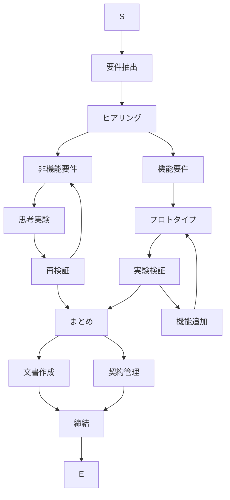

# sample-shape-connector フローチャート概要

このドキュメントは sample-shape-connector.json の内容をフローチャートとしてまとめたものです。ノード（図形）とコネクタ（矢線）の対応を一覧化し、Mermaid で可視化しています。

## ノード一覧

| ID | ラベル | 形状/役割の目安 |
| --- | --- | --- |
| 1 | S | 開始 (Oval) |
| 2 | E | 終了 (Oval) |
| 3 | 要件抽出 | プロセス |
| 4 | ヒアリング | プロセス |
| 5 | 非機能要件 | プロセス |
| 6 | 機能要件 | プロセス |
| 7 | プロトタイプ | プロセス |
| 8 | 実験検証 | プロセス |
| 9 | 思考実験 | プロセス |
| 10 | 再検証 | プロセス |
| 11 | まとめ | プロセス |
| 12 | 文書作成 | プロセス |
| 13 | 契約管理 | プロセス |
| 14 | 締結 | プロセス / 終了直前 |
| 15 | 機能追加 | プロセス |

## 接続（begin_id → end_id）

- 1 → 3
- 3 → 4
- 4 → 5
- 4 → 6
- 5 → 9
- 9 → 10
- 10 → 11
- 11 → 12
- 11 → 13
- 12 → 14
- 13 → 14
- 14 → 2
- 6 → 7
- 7 → 8
- 8 → 11
- 10 → 5 (フィードバックループ)
- 8 → 15
- 15 → 7 (機能追加後に再度プロトタイプへ戻る)

## Mermaid 可視化

番号を図形ラベルに含めず、ID はノード識別のみに使っています。

