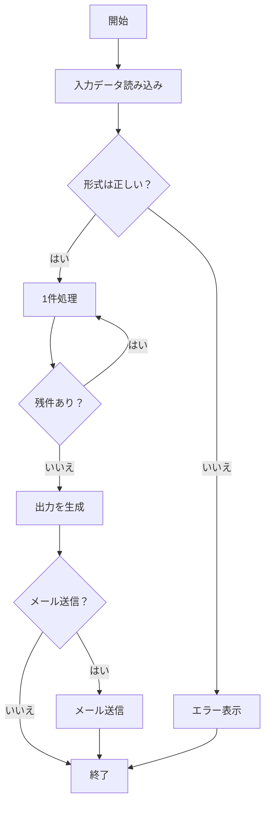

# 📊 sample.xlsx の内容

## 1. 売上データテーブル

| 月 | 製品A | 製品B | 製品C |
|:---|---:|---:|---:|
| 2025-01 | 120 | 80 | 60 |
| 2025-02 | 135 | 90 | 64 |
| 2025-03 | 150 | 100 | 70 |
| 2025-04 | 170 | 110 | 72 |
| 2025-05 | 160 | 120 | 75 |
| 2025-06 | 180 | 130 | 80 |

---

## 2. 売上データ（折れ線グラフ）

- チャートタイプ: Line
- タイトル: 売上データ
- Y軸範囲: 0 〜 200

| 系列 | データ推移 |
|:---|:---|
| 製品A | 120 → 135 → 150 → 170 → 160 → 180 |
| 製品B | 80 → 90 → 100 → 110 → 120 → 130 |
| 製品C | 60 → 64 → 70 → 72 → 75 → 80 |

---

## 3. 業務フローチャート

---

## フロー説明

1. **開始**: 処理を開始
2. **入力データ読み込み**: データを読み込む
3. **形式は正しい？**: 入力データの形式を検証
   - はい → 1件処理へ
   - いいえ → エラー表示へ
4. **1件処理**: データを1件ずつ処理
5. **残件あり？**: 未処理データがあるか確認
   - はい → 1件処理に戻る（ループ）
   - いいえ → 出力を生成へ
6. **出力を生成**: 処理結果を出力
7. **メール送信？**: メール送信が必要か確認
   - はい → メール送信
   - いいえ → 終了
8. **終了**: 処理完了
