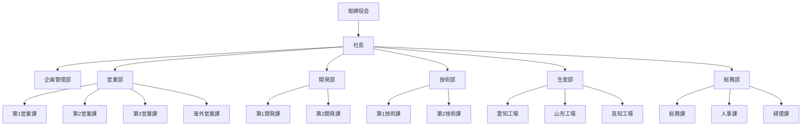

# 📘 sample_smartart.xlsx

## 1. 基本の循環（SmartArt）

- **1**
  - 要件定義
- **2**
  - 報連相
  - 開発
- **3**
  - 実装確認
  - 動作確認
- **4**
  - 対策
- **5**
  - 最終確認

---

## 2. 開始点強調型プロセス（SmartArt）

1. 企画
2. 執筆
3. 編集
4. 制作
5. 校正

---

## 3. 組織図（SmartArt）

- **取締役会**
  - **社長**
    - 企画管理部
    - 営業部
      - 第 1 営業課
      - 第 2 営業課
      - 第 3 営業課
      - 海外営業課
    - 開発部
      - 第 1 開発課
      - 第 2 開発課
    - 技術部
      - 第 1 技術課
      - 第 2 技術課
    - 生産部
      - 愛知工場
      - 山形工場
      - 高知工場
    - 総務部
      - 総務課
      - 人事課
      - 経理課

